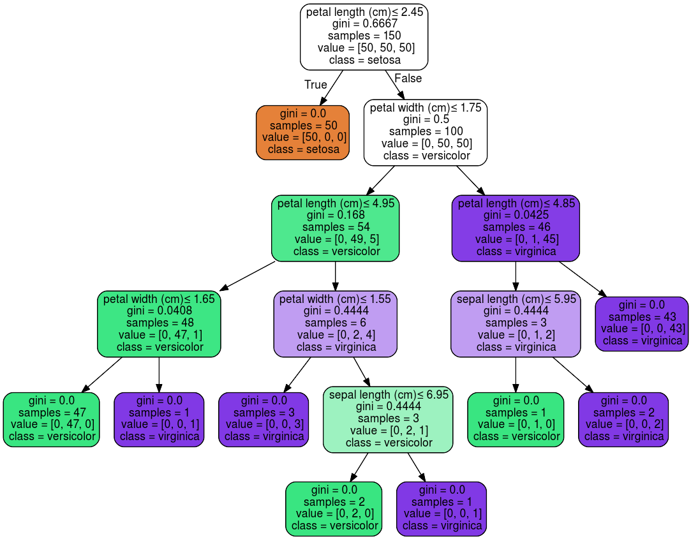
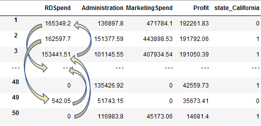
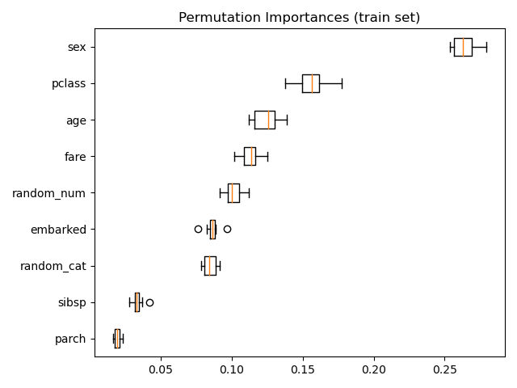
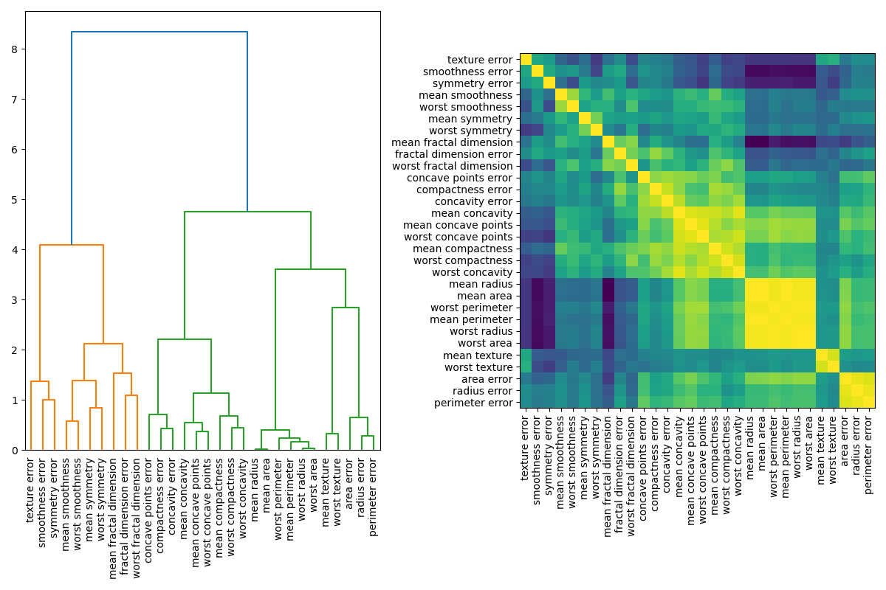
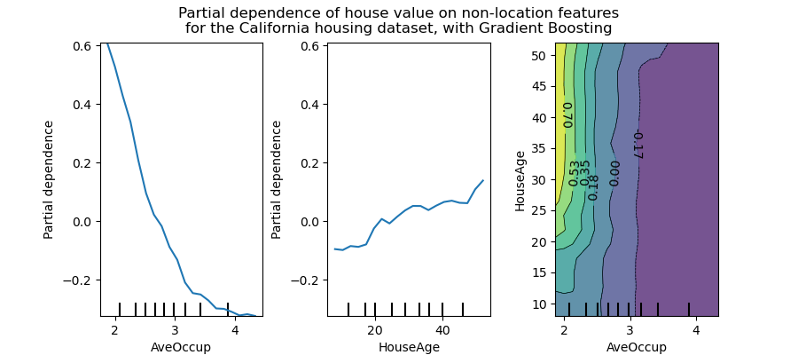

# Introduction

Explaining features and interpreting your models has taken a sharp rise in Europe. Partly because of new laws and regulatory measures being taken, such as GDPR and the EU’s "[Right to Explanations](https://en.wikipedia.org/wiki/Right_to_explanation)", alongside the rise in interest in applying machine learning. This has mandated data scientists to explain why a model has given a certain prediction. For example, institutions with highly sensitive data (i.e. personal data), that have models that output a potentially life changing decision would mandate regulations and require the data scientists to explain the decision that had been made. Hence, this blog post on model interpreting.

This blog post covers Feature Importance, Permutation Importance, Partial Dependency, LIME and SHAP.

---

## Feature Importance

Machine learning models are often considered black boxes. Meaning, data goes in and a prediction comes out, with no understanding on how that decision was made.

There are many types of machine learning models with various algorithms. There are also many ways to interpret a model's prediction. A Decision Tree based model is one of the most popular, mainly because of its white box nature and that it can be visualized with useful modules like `graphiviz`.

<center><sup><i>As shown on Sci-kit learn Decision Trees tutorial.</i></sup></center>

Feature importance can be measured in multiple ways, for example, Decision Tree based models use the Gini importance - read [this](./gini-vs-entropy) blog post to understand what Gini impurity is. Once you have this you can plot it and see which feature is most important for the Decision Tree. For linear models, such as linear regression, the coefficients are used to establish whether a feature is important. Feature selection methods such as `l1` norm reduce dimensionality by selecting only non-zero coefficients. 

However, this can be misleading, particularly for high cardinality data (i.e. attributes with many unique values). Feature importance values will be greater for high cardinality attributes. A popular alternative, which can also be generalized for various machine learning models, is Permutation Importance. 

## Permutation Importance

Permutation importance (PI) is used for feature evaluation and is not biased towards high cardinality features. After fitting a model to the training data, we observe the score of the model when randomly shuffling a single column while keeping all other columns the same. This effectively makes the target value independent of the feature. Computation to calculate PI is more costly compared to impurity or coefficient based importance computations. 

<center><sup><i>Shuffling values within a single attribute.</i></sup></center>

We then calculate the reduction between the baseline score and the model score when shuffling a single column. If the shuffling leads to a worse model score then we know that the feature was important. However, if the feature was not important there would not be much of a drop in the model’s score. On the other hand, if you shuffled the sex column within the Titanic dataset, you would quickly realise that the [sex column was very important](https://scikit-learn.org/stable/auto_examples/inspection/plot_permutation_importance.html), because the model score would significantly decrease. Occasionally, you may find that there would be an unexpected increase in the score for columns you did not expect. In such instances random chance may have caused this. Further analysis should be carried out on the validation set (i.e. unseen data), or, an assessment of the correlation between features should be looked at - the [multicollinearity](https://scikit-learn.org/stable/auto_examples/inspection/plot_permutation_importance_multicollinear.html#sphx-glr-auto-examples-inspection-plot-permutation-importance-multicollinear-py).

<center><sup><i>Figure from Sci-kit learn Permutation Importance.</i></sup></center>

Multicollinear, or correlated features, may return with PI values as zero, when in fact they are important once combined together - *think dividing or multiplying features to create a new feature*. When correlated features are apparent, within the dataset, you can cluster them by using the value calculated on the Spearman’s Rank correlation and then manually pick a threshold value to keep only those features from each cluster. 

<center><sup><i>Figure from Sci-kit learn. Understanding Multicollinearity through dendrogram and heatmaps.</i></sup></center>

Regardless of the PI value observed you should take your time to understand why you are obtaining this PI value. Just because a feature’s PI value is greater than other features PI values we cannot conclude that it is important. The PI does not tell us how each feature matters, if an attribute has an 'average' PI value then it could imply that the feature was not useful for many instances but large for others. This is not very helpful, which is why summary SHAP plots provide an even better solution - more on that later. 

*Note, the feature magnitude does not affect the PI, it will affect it indirectly through the machine learning model selected. For example, in Decision Tree based models scaling has no effect on the model score. However, with Gradient Descent based models it would.*

#### Further reading:
- [Plotting Feature Importance for Tree based model](https://scikit-learn.org/stable/auto_examples/ensemble/plot_forest_importances.html)
- [Permutation Feature Importance](https://scikit-learn.org/stable/modules/permutation_importance.html#permutation-importance)
- [Permutation Importance vs Feature Importance](https://scikit-learn.org/stable/auto_examples/inspection/plot_permutation_importance.html#sphx-glr-auto-examples-inspection-plot-permutation-importance-py)
- [Permutation Importance with Multicollinear or Correlated Features](https://scikit-learn.org/stable/auto_examples/inspection/plot_permutation_importance_multicollinear.html#sphx-glr-auto-examples-inspection-plot-permutation-importance-multicollinear-py)


## Partial Dependence 

Partial dependence plots (PDP) show the dependence between the target and a set of features, whereby we repeatedly change the value of the feature we are interested in. We are essentially plotting the target value response as a function of the feature of interest. We repeat this process for multiple rows across the dataset and plot the average of the outcome on the vertical axis (i.e. partial dependence ~ the change in the prediction). PDP can be thought of as plotting coefficients for simple models like linear or logistic regression. For complex models, it captures more complex patterns.

<center><sup><i>Figure from Sci-kit learn. Partial Dependence Plots for California Housing Prices.</i></sup></center>

You can also observe and plot the interactions between features as a function of the target. For example, in the figure above, the `HouseAge` and `AveOccup` attributes, show that the `HousePrice` is independent of the house age when the average occupancy is greater than two. 

This level of analysis and understanding of a particular feature is not possible with Permutation Importance. Although, these plots are meaningless if features are correlated. PDP should typically be performed with the most important independent features and those of particular interest. 

---
# TO DO HERE ONWARDS

[Insert picture here]

A library named `PDPbox` helps visualize the partial dependence plots - https://pdpbox.readthedocs.io/en/latest/ 

Example picture of partial dependence plots - steps vs complex

In complex models you will observe a smoother curve but in simpler models there will be more of a step. 
PArtial Dependence plots can be used to observe interactions between features.

[insert plot] 

In some cases using both PI and PD is great, but assumptions should not be made about the other. For example, if PD has a feature, `feature_a`, which increases steeply and another than does not, `feature_b`. It is not guaranteed that `feature_a` will also have a high PI value. If `feature_a` was low cardinality, with a single value 99% of the time then changing it would have a big affect on the outcome. Thus, `feature_a` wouldn’t matter much. 

Examples of PI and PD
if y = X1 * X2, then expect PD to be flat but PI, importance, to be high. 

<br/>

### Summary:
Some of this might be overwhelming, so here are two sentences to summarise what each of these tell us:

- Permutation Importance: *Which* variables most affect predictions. 
- Partial Dependence: *How* a variable affects predictions. 

#### Further reading:
- [Plot Partial Dependence](https://scikit-learn.org/stable/auto_examples/inspection/plot_partial_dependence.html)
- [Kaggle Partial Plots](https://www.kaggle.com/dansbecker/partial-plots)

## SHapley Additive exPlanations

SHAP is a game theory approach to explain the output of any machine learning model.  


By using Permutation Importance you can identify which features are important and then by using Partial Dependence plots you understand how the prediction varies based on the changes to individual features. But what if you want to know the *impact each feature has* on the prediction. Perhaps, you need to classify and then explain why you reached that prediction. This is where SHAP comes in. 

SHapley Additive exPlanations, SHAP, can break down a prediction to show the impact of each feature. 

A shapley value is based on game theory. Each feature represents a “player” in the game and the prediction represents the pay-out. The distribution of the pay-outs are shapley values. The shapley values is a method that assigns payouts to features depending on their contribution to the prediction. The features cooperate in a coalition and receive a certain payout because of this corporation. The shapley value is the average marginal contribution of a feature value when making predictions. 

**WARNING**: The shapley value is not the prediction if we had removed a feature from the dataset. It is the average contribution of a feature value to a prediction across all possible coalitions. 

If that didnt make sense then i would suggest learning a bit more about Game Theory, once you do that replace the word “features” with “players” in the above explanation and it should click.

Shapley values are the only method that provides contrastive explanations where it has the potential to compare predictions to a subset of data or a single data point. Methods like LIME assume that there a local linear relationship when it might not always be the case. 

However, the downside of calculating shapley values is the computational load. The number of coalitions can grow exponentially based on the number of features and the number of iterations can contribute a large amount to the computational time. We handle both of these by taking a sample of coalitions and limiting the number of iterations both of which contribute towards the variance in the final shapley value. 

This leads very nicely to SHAP. SHAP uses efficient methods to estimate the shapley values for a given machine learning model. For example, it has TreeSHAP estimation for models that are decision tree based, and kernel SHAP which is kernel based inspired by local surrogate models.

The downside to KernalSHAP is that the kernel may be weightings for samples that are unrealistic. 

Computational complexity from KernelSHAP to TreeSHAP is reduced significantly, O(TL^2M) to O(TLD^2)

SHAP values for each feature sums up why a prediction was different from the baseline. The baseline is the average shapley value for all predictions. You can use SHAP for categorical data too.  https://slundberg.github.io/shap/notebooks/plots/dependence_plot.html 

Shapley values can be used in a global sense, where the SHAP value is calculated for every instance to obtain a matrix of values. We can then interpret the model across the entire dataset. The features with large SHAP values are important. SHAP is similar to permutation importance. However, Permutation feature importance is based on the decrease in model performance. SHAP is based on the magnitude of feature attributions. The feature importance plot does not provide much explanation on a feature apart from the fact it is more important than others. Instead, you should look at the SHAP force summary and SHAP feature dependence plots. 

A force plot shows, for a single instance, which features contribute towards pushing the model to a certain value. We can combine multiple force plots together and then rotate it to have a summary across the entire dataset. https://slundberg.github.io/shap/notebooks/tree_explainer/Census%20income%20classification%20with%20LightGBM.html 

You can cluster shape values for instances that are similar. 

The benefits from shapley values applies with SHAP values too. The have a solid theory (from Game Theory) and provides contrastive explanation while connecting with LIME too. 

Overall, using SHAP provides a consistent approach for both global and local explanations. Meanwhile, the alternative to use LIME for local explanations, and permutation importance and partial dependence for global explanations will lack clarity. 

SHAP is subject to misinterpretation and can hide biases if you’re not careful. 

The SHAP library also has many other visualizations which are comparable to permutation importance and partial dependence plots. 

!(SHAP Values adding up to make a prediction)[]
https://christophm.github.io/interpretable-ml-book/shap.html#shap 

<br/>

## Local Interpretable Model-Agnostic Explanations - LIME

Using `PI` and `PD` have their limitations. They work really well with simple models but can be difficult to use and interpret when using it on complex models. Furthermore, depending on the model runtime it could take up a lot of computational resources. This is where LIME (Local Interpretable Model-Agnostic Explanations) comes in. 

The library is : https://github.com/marcotcr/lime 

You need to format your data and pass it to the Explainer class. Once you have the explainer you can pass an observation and a prediction function. You can then visualize how each of the features influences the prediction. As the values are dependent on the linear model being fit locally around a given observation, you should also check the r2 score. If the value is low then you cannot be confident with the LIME outcome. However, if all your models show a feature which continuously negatively affects the decision then this feature should be removed. 

<br/>

#### Summary Plots

Summary plots show many useful insights into all the features.

Each dot shows three characteristics: 

- Vertical location is the feature it is representing.
- Color shows the magnitude of the feature value for that row. 
- Horizontal location is the effect of that value causing a higher or lower prediction. 

In the plots you can gain a strong intuition on how a decision was made by your black box model. Some features will generally have no input in the prediction until a certain feature value, whereas some features will have zero input and is ignored entirely by the model. 

<br/>

## SHAP Dependence Plots

You can then single our individual dots and see how each of the rows differ. For example, if there is a wide spread then we can assume that other features are interacting with the feature also. You should also look for dots that are far away from the trend. This will give further insight about the data. 

A wider spread implies a bigger range of effects on predictions. The range does not indicate a higher permutation importance, because a few outliers can ruin this assumption. However, if all the dots are widely spread out then we can assume the permutation importance is high because the range of effects is sensitive to outliers within that feature.

If a feature has jumbled values then the feature values leads to high or low predictions. This implies the feature has an interaction with another feature. For example, a binary feature 0 which could make this feature more relevant but when it is 1 it is no longer relevant. 


## Python Package `eli5`
A popular Python Package to help debug and explain machine learning models is [eli5](https://eli5.readthedocs.io/en/latest/index.html). It works with many of the popular machine learning frameworks and packages, including: Scikit-Learn, Keras, XGBoost, CatBoost and Keras.

Data science is about exploring and there is a huge element of that when it comes to debugging models, building trust, and learning insights to make better decisions. 
https://slundberg.github.io/shap/notebooks/plots/dependence_plot.html 
https://www.kaggle.com/dansbecker/advanced-uses-of-shap-values  
**Calculate and show permutation importance:**

```py
import eli5
from eli5.sklearn import PermutationImportance

perm = PermutationImportance(my_model, random_state=1).fit(val_X, val_y)
eli5.show_weights(perm, feature_names = val_X.columns.tolist())
```

**Calculate and show partial dependence plot:**

```py
from matplotlib import pyplot as plt
from pdpbox import pdp, get_dataset, info_plots

# Create the data that we will plot
pdp_goals = pdp.pdp_isolate(model=my_model, dataset=val_X, model_features=feature_names, feature='Goal Scored')

# plot it
pdp.pdp_plot(pdp_goals, 'Goal Scored')
plt.show()
```

**Calculate and show Shap Values for One Prediction:**
```py 
import shap  # package used to calculate Shap values

data_for_prediction = val_X.iloc[0,:]  # use 1 row of data here. Could use multiple rows if desired

# Create object that can calculate shap values
explainer = shap.TreeExplainer(my_model)
shap_values = explainer.shap_values(data_for_prediction)
shap.initjs()
shap.force_plot(explainer.expected_value[0], shap_values[0], data_for_prediction)
```


<br/>

### When to use each?

Use **permutation importance** if you require a **succinct model summary**. Summarizing importance of all features in a global sense. 

Use **partial plot** to understand **individual features or relationships** between features (i.e. using 2D partial dependence plots). Summarizing the importance of a single feature and its effect on the prediction in a global sense.

Use **SHAP** when you need to show the **impact of each feature for a given row**. If you require a global sense of a feature you can also use this too. 


## Conclusion

Being able to use machine learning to predict the probability of a patient having cancer is a great asset to have for any health care professional. But telling a patient, “you have a high probability of having cancer” is not enough. 

Interpreting a machine learning model prediction can break down what features an individual should focus on in order to reduce their risk.

Many methods can help us identify which features to focus on and then measure individual feature importance. However, interpreting these values are crucial for data scientists to avoid introducing biases into the prediction. SHAP is widely considered the optimal solution due to its Game Theory approach, however, all interpretation methods should be explored before being confirmed by a domain expert. 

Model interpretation is not going away. Law makers will demand data scientists to interpret their models and these tools are just the start of an expanding specialism within data science.

<br/>

#### Further reading:

- Things to avoid when interpreting models - highly recommend reading [this paper by Standford](https://arxiv.org/pdf/2007.04131.pdf)

- [Interpretable Machine Learning Book](https://christophm.github.io/interpretable-ml-book/) by Christoph Molnar

- PyData Talk on [Interpreting models with LIME and SHAPE](https://www.youtube.com/watch?v=C80SQe16Rao)

- PyData Talk on [SHAP Values](https://www.youtube.com/watch?v=0yXtdkIL3Xk)

<br/>

---

** If you are interested in more data science topics then check out my other blogs [here](./blog).**

- [Starting with Package Managers](./starting-with-package-managers)
- [Docker Devcontainers](./docker-devcontainers)
- [Impurity Criterions](./gini-vs-entropy)
