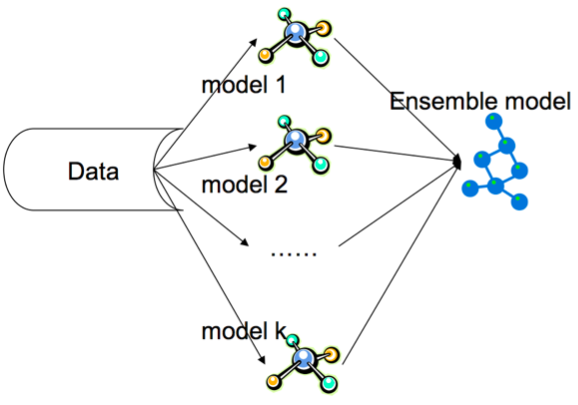
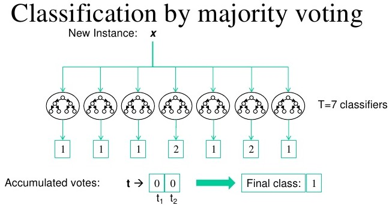

*This blog is part of the short blog series, where I will give a brief insight on various key topics.*

This article describes the concept of the Wisdom of the Crowds and how we can reflect and apply this theory when creating machine learning models. Ensemble methods find their origins in the principle of Wisdom of the Crowds and typically result in an improved model and better than the individual models within the ensemble.

> The Wisdom of the entire crowd is better than the wisdom of the wisest individual within it.

 

You have probably seen a game show, if not then Google [Who Wants to be a Millionaire](https://youtu.be/SpzZBYTdQO8?t=104). The show has an option, where the contestant can ask the audience and, most often, majority of the audience would get the question correct. However, there are a few exceptions where majority of audience gets it wrong.

This could have been because one row of the audience just copied each other, or carried out the exact same methodology in answering the question. Similiar to how an entire class of pupils get the same question wrong because of that one awful teacher that showed them the incorrect methodology!

A potential solution to this problem is if each audience member thought independently from one another and answered the question using an entirely different methodology.

This is exactly how an Ensemble model that contains different types of machine learning model which are trained using different algorithms. For example, rather than having 3 logistic regression models within the Ensemble, you should create 3 independent models that have different learning algorithms, such as a Support Vector Machine (SVM), Decision Tree and Logistic Regression.

An example of an ensemble model is shown on the image below using the [MNIST Digit dataset](https://www.kaggle.com/c/digit-recognizer) - * I have produced a CNN model that came in the top 15% in the Kaggle competition - [see here](https://www.kaggle.com/ashishthanki95/competitions)*. As you can see, some classifiers have predicted the value of 2, however majority of the models within the ensemble has correctly predicted the value of 1. Therefore, the final model predicted 1.

Many of the winning models within Kaggle competitions are Ensemble models and why it is crucial to understand them. There are many types of Ensemble models such as Stacking, Boosting and Bagging that are worth exploring. A great read on all of them can be found on [Sci-kit learn](https://scikit-learn.org/stable/modules/ensemble.html).

There is exciting research being carried out on enhancing the benefits of Ensemble models, which uses wisdom of the crowds theory, such as [this paper](https://arxiv.org/ftp/arxiv/papers/1605/1605.04074.pdf) and [this blog post](https://machinelearningmastery.com/what-is-ensemble-learning/).

###### References:

- *The Art of Science by D. Speigelhalter.*
- *Hands-on Machine Learning with Scikit-Learn, Keras, & TensorFlow by A. Geron*
- *Investopedia: [Wisdom Crowds](https://www.investopedia.com/terms/w/wisdom-crowds.asp)*

 

--- 

** If you are interested in more data science topics then check out my other blogs [here](./blog).**

- [Docker Devcontainers](./docker-devcontainers)
- [Starting with Package Managers](./starting-with-package-managers)
- [Impurity Criterions](./gini-vs-entropy)

**Check out my other shorts blocks [here](./tags/shorts).**
