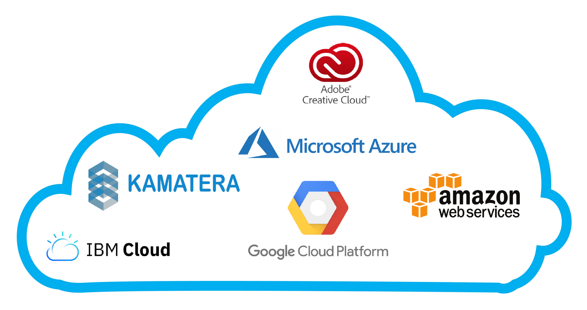

**TLDR**: You have to ask yourself, as a business, do you have the technical and engineering personnal to manage and maintain a scalable on-premise infrastructure. Most start-ups will probably say no. IaaS, PaaS and SaaS are scalable solutions that will work for most businesses. To successfully implement a type of service, will depend on the employers drive to upskill their team and getting the whole team's buy-in. Specifically, for IaaS and PaaS, businesses will need to understand how to develop applications on cloud technology if they aspire to grow. Digital migration is an inevitability.

<i>Popular Cloud Providers</i>

## Introduction

When a business grows it will come to a point where more computational resource is required, probably in the form of a server. A decision needs to be made whether in-house servers should be purchased (and maintained), or a cloud computing platform solution is explored.

The world has increasingly started to use cloud computing as a longer term scalable solution for applications, storage, analytics and back-up capabilities (to name a few). Not every business has the capacity to house servers, or the expertise to set up the necessary IT infrastructure (and support). 

[Amazon Web Services](https://aws.amazon.com/) (AWS), [Microsoft Azure](https://azure.microsoft.com/en-gb/) and [Google Cloud Platform](https://cloud.google.com/) (GCP) are the [dominent cloud providers](https://www.zdnet.com/article/the-top-cloud-providers-of-2021-aws-microsoft-azure-google-cloud-hybrid-saas/) in the world right now. Due to the COVID pandemic, many businesses have either failed to adapt to rise in users while, those that have migrated to the cloud have grown.  

A quote from the [International Data Corporation](https://www.idc.com/about):

> "When all is said and done, we expect to find that early adopters of cloud and other digital technologies were best positioned to ride out this kind of storm with the least amount of disruption from an operational perspective..."

## The Problems

##### *Skill Shortage*
Many business leaders are concerned about not having the right expertise to handle the cloud migration and ongoing management of their cloud infrastructure. Needless to say, this is a global problem. Where globally, there is a [huge skill shortage](https://business.linkedin.com/content/dam/me/business/en-us/talent-solutions/emerging-jobs-report/Emerging_Jobs_Report_U.S._FINAL.pdf) for programmers, software developers, data scientists and cloud service professionals. Global demand for some IT jobs have increased to as high as [517% in 2020](https://www.technojobs.co.uk/info/career-advice/10-most-in-demand-it-jobs-for-2020.phtml).

##### *Capital and Operational Costs*

Other than skill shortages, the cost is the main driving factor for any business. There two main reasons why cost has pushed many businesses towards cloud computing over conventional on-premise solutions:

1. **Associated start-up costs**: Tradionally, IT expenses have been considered as capital expense (**CapEx**). Meaning individual IT equipment such as laptops, desktops and servers would need to be purchased initially. This large start-up cost causes significant cash flow issues. Typically, the server costs (depending on server specification) will be in the excess of £10k for (a basic) 1 rack server with the high specification machines easily costing up to £100k+. 
2. **High operational costs**: The heating, ventillation and designated space associated with running the server (and ancillary IT equipment) are considered as operating expenses (**OpEx**). The OpEx can depend on the server type but a basic server OpEx would be around £5k per month*, with the potential to rise to over £100k+. A typical office space in London would cost around £1.5k per square foot so even a small server room would surge OpEx for businesses.      

<i>*Coming from a mechanical engineering background and having designed a few server rooms myself. I can concretely confirm that the process of designing, constructing and procuring HVAC equipment is a length and costly process. Although, strictly speaking, this would be considered a CapEx.</i>

CapEx and OpEx can slowly start to become out of hand if the business continues to grow rapidly. Ultimately, servers will crash or need replacing. Eventually, this will affect the end user and, therefore, reduce revenue. I once worked for a company where the IT infrastructure was so poor that there was no access to folders or files for all running projects for several months. This costed the company a lot of money and ruined thier reputation.

Cloud technology enables businesses to shift the initial heavy front end CapEx to a manageable OpEx. Further more, most cloud platforms have a pricing calculator to estimate the cost of using their products, services and resources. 

- [AWS pricing calculator](https://calculator.aws/)
- [Azure pricing calculator](https://azure.microsoft.com/en-gb/pricing/calculator/) 
- [GCP pricing calculator](https://cloud.google.com/products/calculator)

## Cloud Computing 

The large CapEx of an on-premise server naturally results in the aspiration of keeping this tangible asset as long as possible. Ideally, until its dying breath. However, the mechanical parts within the server such as the hard drive and fans will get louder and eventually wear and tear will lead to failure. Other than the mechanical restrictions, storage and memory capacity will shortly become scarce. These problems are exasperated when the technological curve moves forward. Today we have 4k videos, tomorrow we will have 8k, and then 16k a few days later. Making the 10 year old server, with a "large" 50TB hard drive ancient and incapable of carrying out its duties for much longer. 

This is where cloud computing comes in. You no longer need to worry about the expensive server and dragging it on till its dying breath. Cloud platform providers update and maintain the infrastructure, while also allowing you to use the latest chip technology, such as Google's Tensor Processing Unit (TPU). Seeping the benefits of Moore's Law.   

##### *Moore's Law*

[Moore's law](https://en.wikipedia.org/wiki/Moore's_law) shows us that computer processing speeds double every 18 months while becoming cheaper to manufacture. Apple's [M1 chip](https://www.macrumors.com/guide/apple-silicon/) has pushed the boundaries for computer chips and has made many question the longevity of Intel's dominance in the market. Without sounding like the Greek mythological [Hydra Monster](https://en.wikipedia.org/wiki/Lernaean_Hydra) that would regrow two heads for every chopped off head. Even if silicon-based chips hit a wall, two more solutions will spark to life. Perhaps, Quantum Computing, Graphene/Carbon Nanotubes or Nanomagnetic Logic? 

The possibilities and use cases that faster and superior chips can bring to humanity is endless and unimaginable. The first iPhone was released, 14 years ago, in 2007. In just a short 14 years the world has changed and in that time technology based companies have taken over. Out of the 10 most valuable companies in the world 9 of them are technology companies. In 14 years, the future of technology will be unrecognisable from what it is today. This is why embracing the change and modernisation of your IT infrastructure is critical for your business' success. 

---

## Types of Cloud Computing Services 

There are three main cloud computing services: 

**Infrastructure as a Service (IaaS)**: is there to provide you with maximum flexibility when it comes to hosting custom-built apps, as well as a providing a general data centre for data storage.

https://azure.microsoft.com/en-gb/overview/what-is-iaas/ 

**Platform as a Service (PaaS)**: is most often built on top of an IaaS platform to reduce the need for system administration. It allows you to focus on application development instead of infrastructure management. Therefore, you manage the applications and services being developed, and the cloud service provider typically manages everything else.

https://azure.microsoft.com/en-gb/overview/what-is-paas/ 

Some cloud platforms have partners, which would enable you to use a cloud platform as a SaaS where they essentially create a software "wrapper" around your PaaS infrastructure. This means you do not need to upskill your team to understand cloud technology, cloud migration process or the ongoing management of their cloud infrastructure. 

**Software as a Service (SaaS)**: Offers ready-to-use, out-of-the-box solutions that meet a particular business need (such as a website or email). Most modern SaaS platforms are built on IaaS or PaaS platforms.

#### What are the differences between IaaS, PaaS, and SaaS?

Using PaaS is often what Azure would push. As you gain all the benefits of IaaS because you do not have the technical personal in house to manage the infrastructure. A good analogy is shown in the diagram below. 

plus a hybrid version which is not strictly cloud computing per say. Hybrid is essentially mixture of IaaS and on-premise serves. A bank, or goverment would opt for this sort of solution with the sensitive data that they have. 

# insert metaphor picture here
As quoted in https://www.hindawi.com/journals/js/2015/834217/ 

### Which one to choose? 

Most companies get started with the cloud through either IaaS or Saas. IaaS has the same model but replaces existing infrastrucutre with a cloud providers. This model works particularly well when While SaaS are for those that have technical knowledge but are seeking to enable more use case for their data.

Most companies get started with the cloud with SaaS which works fine for most indviduals. But as your company grows and you need more flexibility then a PaaS is the way to go. 

to a wider capability then you need a PaaS

This is not techincal cloud computing blog 

A data scientist does not need to know the ins and out of all the services each cloud provider offers. Instead, understanding the basic blocks and definetly the differences between cloud computing services is beneficial. The next step would be to understand cloud infrastructure. 

This blog post will help you getstarted: 
 - https://aws.amazon.com/blogs/enterprise-strategy/12-steps-to-get-started-with-the-cloud/ 
 - https://aws.amazon.com/blogs/enterprise-strategy/a-12-step-program-to-get-from-zero-to/ 

# you have the final decision, do you want to upskil and get with the times or be left behind?

If you're an optimist, like me, I hope we get to a point where we would ask "why would you want to offload processing to the cloud when your phone is quicker?" 
