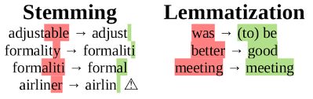

<!-- markdownlint-disable-->

Natural Language Processing (NLP) is a bit of a buzzword nowadays with job posts asking for 10 years of experience on the BERT model that has only been around since 2018. NLP is still an active area of research and is changing very quickly every year. With new architectures and layers being wrapped together for the finest of improvements. This blog gives an overview of NLP and provides resources to allow you to explore further.

## Natural Language Processing

Natural language processing is the interaction between computers and human languages. Text data ultimately needs to be processed in such a way that computers can understand and analyse in order to gain hidden insight about the data. 

NLP unlocks the door for solving many problems, such as, automatic summarization, translation, sentiment analysis, speech recognition and topic segmentation. Text data is all around us, in reports, books, comments, blog posts, news articles, emails and more. Having to look at this data manually can be troublesome. 

A good example of using NLP is interpreting surveys. Imagine, you carry out a survey asking individuals from various countries how they feel about their national government. Going through individual descriptions would take a long time. Instead, using NLP we can classify each comment into negative, neutral or positive. Grouping the comments into countries so we can then perform data aggregation. Giving a clearer picture on how individuals feel about their government. This is just the tip of what NLP can offer and is called Sentiment Analysis, probably one of the widely known applications.

Without taking you back to primary/elementary school, we know that words can be “classed” under nouns, verbs, adjectives and adverbs. These classes are known as lexical categories and form the foundation for many NLP tasks so read up on them (here)[https://www.bbc.co.uk/bitesize/guides/zx3gr82/revision/5] and come back! If you have a background in tabular data, you can think of these lexical categories as features. The more useful the feature that we can extract about the data the more useful the NLP model will be at its task.

## Cleaning text data types

In my opinion, the most challenging part about working with text data is the data cleaning and processing stage. Most models will be off-the-shelf from TensorFlow Hub. It is unlikely that you'll be training your own NLP model. It is, however, likely that you'll have to preprocess your input data so that it is in the correct format (and shape!) for the selected model. Rather than providing the inidividuals steps for a single model, below are a few popular data processing techniques. Remember, the aim of these techniques are to provide additional features that the model can learn from.

- **Removing StopWords**: words that add no value to the interpretation of the data should be removed. For example, words like “an”, “the”, “a”, “be” etc. create noise while modelling. 

- **Tokenization**: break down the unstructured text data into chunks of information so it can be counted as discrete elements. For example, split a sentence into individual words. The BERT model has a specific tokenization processing step which can be read within the [BERT paper](https://arxiv.org/abs/1810.04805) and tensorflow's [`text.BertTokenizer`](https://www.tensorflow.org/text/api_docs/python/text/BertTokenizer) function.

- **Tagging**: typically follows Tokenization in a NLP pipeline. This is the process of tagging each word with a speech tag. Outputs are in the form of `(word, tag)`. For example, “new” has a tag “ADJ” (adjective), “early” has a tag “ADV” (adverb) and “Europe” will have a tag “NOUN” (noun). See more tags [here](http://www.nltk.org/book/ch05.html#tab-universal-tagset).

Tagging can often be incorrect based on the context, so performance is evaluated based on the gold standard test data. The gold standard test data is the “correct” tag as classified by a human expert – which could be incorrect and have biases. Nevertheless, the gold standard is widely considered the evaluation metric for automatic tagging.

- **Stemming**: removes the last few letters of words that can be defined the same. For example, “travel”, “travelling” and travelled” are all verbs describing the same action. There are various types of stemmers: Lancaster, Snowball and Porter. Read [this](https://stackoverflow.com/a/11210358) stackoverflow post.

- **Lemmatization**: using knowledge base called WordNet, you can convert similar words into the root word. For example, “ate” and “eat”.

The general purpose behind **Stemming** and **Lemmatization** are to get words with the same meaning to be modelled together. 

- **Vectorization**: converts text into numbers. There are many forms of [vectorization](https://www.oreilly.com/library/view/applied-text-analysis/9781491963036/ch04.html), one popular way is the bag of words technique. For example, the sentences “this is great.” and “but this is not great” would become `sentence_1 = [1, 1, 1, 0, 0]` and `sentence_2 = [1, 1, 1, 1, 1]`. Because [“this”, “is”, “great”, “but”, “not”] is the order of the columns. 

Another popular way is count vectorization where we replace the word with the number of occurances within the corpus. However, this technique has mixed results.

## Implementing NLP 

Although NLP can seem like there are many possible solutions it is fairly easy to implement. There are many open source tools that allows us to implement state of art NLP models and preprocessing steps. We can use the Natural Language Toolkit [NLTK](https://www.nltk.org/) package for NLP tasks, [TensorFlow Hub](https://www.tensorflow.org/hub) for transfer learning models and, more recently, the very popular [HuggingFace](https://huggingface.co/) library. Lets talk about the Multi-head attention layer which is widely consdiered a [big breakthrough](https://paperswithcode.com/method/multi-head-attention) in NLP - gone are the times of vanilla RNNs and LSTMs! 

## Multi-Head Attention

Multi-head Attention layer is based on the Scaled Dot Product Attention layer. In short you can think of it as a differentiable dictionary lookup that attempts to learn whether a word is a verb, subject, noun etc. but remember that each word is represented as a vector (learned during training).

The encoder within the layer represents the words as vectors. Suppose the decoder already has translated the beginning of a sentence, it will now look for the next logical word to translate. For example, "They played tennis", the decoder translates the subject "They" and now looks for the verb based on its vectorized representation, called a query. The query and the key to the word (i.e. the encoder's representation) are compared and similiarity measure is used.

Having multiple of these types of layers allows the model to represent a word into different subspaces. All information about the word is split across the layers such as whether the word is a verb, past tense, etc. Machine translation is extremely broad and can definetly not be summarised within a sub section of a blog post. I would recommend [this](http://web.stanford.edu/class/cs224n/s) Stanford course for an in-depth appreciation on the extensive work being carried out within the field of machine transation. [Ashish Vaswani](https://paperswithcode.com/search?q=author%3AAshish+Vaswani) was the lead researcher on creating the attention is all you need (nice name) architecture. 

Tensorflow has many Transformer based architectures that have been successful in performing many NLP tasks. This is a promising architecture for NLP tasks and many state of the art models contain the attention mechanism architecture in part. 

## Conclusion

As mentioned, you should not be building the architecture of your NLP model. There are many models that can be customised for your use case on [TensorFlow Hub](https://tfhub.dev/) and [HuggingFace](https://huggingface.co/). These libaries even include functions that can be used to preprocess your data to the model you have selected.

#### Further reading:

- Chapter 1 of [Natural Language Processing with Python](http://www.nltk.org/book/) book. 
- Stanford's [CS224N Course](http://web.stanford.edu/class/cs224n/s)
- Attention is all you need [paper](https://arxiv.org/abs/1706.03762)

