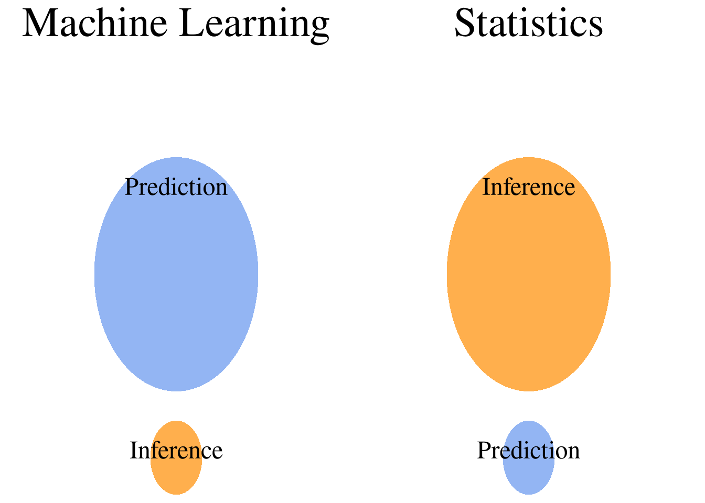
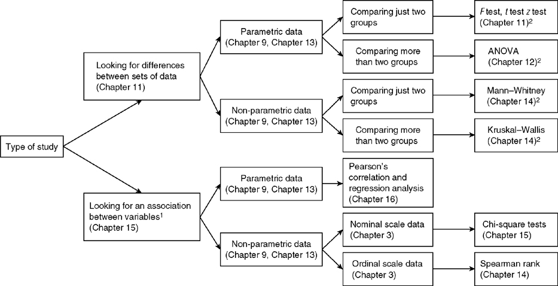

# Introduction

This blog discusses the statistic tests that are commonly used by data scientists during various stages of machine learning workflows, carry out data analytics, and answer questions that can make better-informed business decisions. Statistics are used to study, manipulate, gather, analyze and draw conclusions from data. The two major areas of statistics are descriptive and inferential statistics.

Descriptive statistics is what you *should* have learnt during high school. It involves aggregated values of your data, such as the mode, mean, median, max, min, kurtosis, skewness, variance, standard deviation and inter quartile range. I won't go over each of them but a single Google search of each word should be self explanatory. Once you have done that come back here. All these values can be grouped into the larger groups: measure of central tendency,  measure of variability, measure of frequency and measure of position. 

Inferential statistics is used when you have a small sample of data and want to infer something about the larger population distribution. We perform data analysis on the sample and make generalizations about a population. This type of analysis can also be used to compare two or more groups of samples. We can do this by using the common methodologies: **hypothesis tests, regression analysis and confidence intervals**.

# Inferential Statistics

Inferential statistics is, arguably, the most useful for day to day analysis. This blog post covers:

- Hypothesis Testing
- Regression analysis 
- Confidence Intervals
- ANOVA and T-Tests
- Correlation
  - Pearson correlation
  - Spearman correlation
  - Kendall correlation
- Contingency tables
- Chi Squared Tests
  - Test of Independence
  - Goodness of Fit

## Hypothesis Tests

From hypothesis testing we gain an understanding about two mutually exclusive statements, about a population, to determine which statement is correct about the sample. Hypothesis testing consists of a null hypothesis that, typically, assumes there is no difference between the sample(s) and population; meanwhile, the alternative hypothesis is the opposite that assumes there is a statistical difference. 

Before we dive deep into the type of methodologies, lets briefly run though Type I and Type II error. These type of errors are analogous to the terminology we use for classification problems.

#### *Type I and II Error*

*Type 1 Errors are **false positives**, where you reject the null hypothesis when it is actually true in the population. Meanwhile, Type II Errors are **false negatives**, where we fail to reject the null hypothesis when it is actually false in the population. See [Paper on Hypothesis Testing and Error Types](https://www.ncbi.nlm.nih.gov/pmc/articles/PMC2996198/).*

*The probability of a Type I Error is called alpha, while the probability of a Type II Error is called Beta. Ideally, these value should be zero but this is very rarely the case in real world problems. One way to reduce these probabilities are to **increase the sample size** - as with all data science problems!*

It is important to remember that we cannot completely eliminate these uncertainties and, when appropriate, should **report the uncertainty** whenever hypothesis testing. Another important point to remember is that we cannot ‘prove’ or ‘disprove’ anything by hypothesis testing and statistical tests.

To reject the null hypothesis, we must specify the maximum allowable probability of making a Type I Error, called the level of significance (denoted by alpha) for the test. Typically, this value is 5% or 1%, assuming a 95% or 99% confidence. When the p-value is less than the alpha value we can reject the null hypothesis and accept the alternative.

Another way to interpret the p-value is the probability that the observed difference occurred by random chance. So having p-value of less than 5% is what we want! 

Hypothesis tests are used to provide a statistical comparison between each of the groups - sample or population. There are many tests we can perform, as highlighted below.

--- 

### ANOVA Tests 

Are similar to T-Tests but are used when you want to compare greater than 2 samples. For example, if you wanted to know whether 3 school classes were statistically different. 

### T-Tests

Are used to statistically compare two samples of data. For example, if we wanted to know whether 1 school class were taller than the other. 

An additional assumption within the data is Homogeneity of variance within the samples are constant. 

#### Contingency Table

Contingency tables are used to compare the observed results to the expected results. 

If a given feature is categorical you can create a contingency table. This was first introduced by Karl Pearson, with the intent of being used to help determine whether one variable is contingent upon, or depends upon, the other variable. The contingency table helps determine relationships between categorical data. Naturally, this allows for Chi Squared to be used as the statistical test when comparing categorical data, therefore, eliminating many other tests available. 

### Chi Squared Tests

Chi Squared can be used to show the association between categorical variables. There are many variations of Chi Squared tests but the two that provides the insight required for most problems are:

### Test of Independence

Tests whether there is a relationship between two types of categorical features, i.e. Age groups and weather. If the null hypothesis is rejected, then this implies the categorical data is dependent. 

#### Goodness of Fit

Compare the distribution for a small sample vs the larger sample, i.e. compare the number of accidents in the various weather conditions against the other drivers within the dataset. If there is no observed difference, we can accept the null hypothesis and conclude that there is no difference between young drivers and the other age groups.  

A small variation of Chi Squared is the G-Test. The chi-square test gives approximately the same results as the G–test. However, unlike the chi-square test, G-values are additive, which means they can be used for more elaborate statistical designs. More specifically, Pearson's Chi Squared test is a score test, whereas the G-test is a likelihood ratio test. Researchers often conclude that the G-Test outperforms the Chi-Squared test. For sake of completeness both test were carried out and resulted in the same conclusion described below. Using Python, the G-Test can be performed by simplying changing 1 input from SciPy.Stats’ power_divergence function (i.e. lambda_="log-likelihood").

The benefit of the Chi-Squared/ G-Test is the contribution plot that can be produced under a null hypothesis rejection.  This analysis can then be carried out as it is often useful to look at the cell-wise contributions of the χ2 statistic to see where the evidence for dependence is coming from. Pearson residuals can also be plotted in such a scenario and can also be used to quantify the difference between the observed in units of the dispersion of the fitted model.

Generally, if the Chi Squared contribution value is above the critical value for Chi Squared then we can reject the null hypothesis, alternatively, if we are below then we accept the null hypothesis, i.e. there is no statistical difference between the categories within this dataset. 

Test of Independence Chi-Squared Hypothesis
Null Hypothesis:
“There is no relationship between driver age groups and the number of collisions that occur in the rain and fine weather.”

Alternative Hypothesis:
“There is a relationship between age groups and collisions that occur in the rain and fine weather.”

Goodness of Fit Chi-Squared Hypothesis
Null Hypothesis: 
“There is no difference between the young drivers collision distribution and the other age groups distribution.”

Alternative Hypothesis:
“There is a significant difference between the young drivers collision data and other age groups, thus the young driver collision distribution is different compared with other age groups in fine and rain weather.”

### Correlation Tests

Correlation tests allow us to understand the relationship between features. In ML it can help us understand the relationship between independent variables and the dependent variable. There are three frequently used tests.

#### 1. Pearson correlation
Evaluates the linear relationship between two continuous variables.

#### 2. Spearman correlation
Evaluates the monotonic relationship.

#### 3. Kendall correlation
Similar to Spearman where it evaluates monotonic relationships and measures the strength of dependence between two variables. This is the preferred correlation when there are small samples or some outliers.

Further reading on correlation:

https://datascience.stackexchange.com/a/64261
https://www.statisticssolutions.com/free-resources/directory-of-statistical-analyses/correlation-pearson-kendall-spearman/

---

### Parametric and Non-Parametric Tests

All these tests might seem overwhelming at first but once you start running through a few examples it will start becoming very simple and logical. In fact, there are many flow diagrams, below, which allows you to figure out which methodology can be used to answer your question and fits the type of data.

As you can see there are many method in inferential statistics. However, there are several important considerations before we perform any type of test. This includes: 

- Normality: does your data follow a normal (bell curve) distribution.
- Homoscedasticity: does your data follow variance within the data is constant. 
- Is your data a representative sample from the population.
- Random independent samples
- Comparable scale ratio level of measurement.
- No outliers
- Homogeneity of variance.

Fortunately, there are several alternative tests that we can perform instead of the standard test, these types do not have the same assumptions and are non-parametric alternatives. 

To perform these tests on Python we can use `scipy.stats`, read the guide [here](https://docs.scipy.org/doc/scipy/tutorial/stats.html).

Parametric Tests are more powerful and are likely to detect a difference that truly exists. They are also less likely to output a Type 2 error than Non-Parametric tests. Parametric tests require a large sample size compared to Non-Parametric tests.
 
The specific Non-Parametric tests for each methodology have many underlining assumptions about the data, for example:

- Kruskal-Wallis and Friendman’s is an alternative for ANOVA tests and must have the same shape and equal variance.
- Man-Whitney test is an alternative for T-Tests but must have the same shape.
- Wilcoxon Signed-Rank Test is an alternative for a one-sample T-Tests but assumes that both populations must have [symmetric distributions](https://stats.stackexchange.com/questions/141018/help-with-understanding-the-assumptions-of-wilcoxon-signed-rank-test).
 
There are many other Non-Parametric tests which have not been listed here which have there own assumptions about the data being tested.

## Conclusion

Comparing ML and Statistics. ML is used for predictions while Statistics uses the underlining data to infer a probability distribution. You do not need to remember all the tests but understanding the general logic behind how to approach a statistical problem is all you need. I recommend going through a few iterations of the methodology and writing null and alternative hypotheses. In conclusion, the statistical approach depends on the data and the reason for the analysis.

#### Further resources

- [Inference vs Prediction Blog](https://www.datascienceblog.net/post/commentary/inference-vs-prediction/)
- [Chi Squared Tests](https://www.statisticshowto.com/probability-and-statistics/chi-square/#chisquareqtest)

