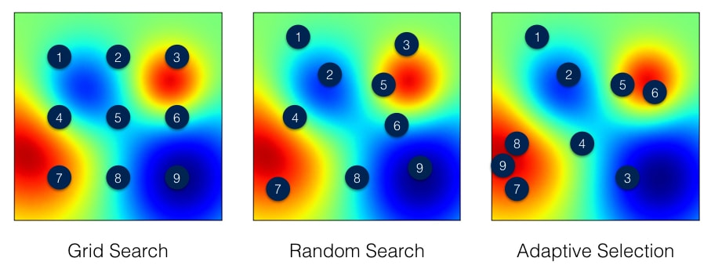

READING:

- [Massive Parallel Hyperparameter Optimization](https://blog.ml.cmu.edu/2018/12/12/massively-parallel-hyperparameter-optimization/)

# Introduction

There are many Hyperparameter Optimization (HPO) libraries to aid in finding the best hyperparameters for ML models but all of them incorporate different search algorithms, thus, outputting different parameters and model scores if the number of iterations are not sufficient.

The library to use ultimately depends on the machine learning problem that you are trying to solve and complexity of the model, for example, deep neural networks have a larger number of parameters and an exhaustive search would take days (or even weeks!).

Exhaustive methods such as grid search (and randomized grid search) evaluates all possible hyperparameter combinations (or number of defined iterations, `n_iters`, for randomized) within the parameter grid and reports back the best combination. The issues with the exhaustive methods is that we do not use past evaluation results to select next hyperparameters to evaluate. The two most popular HPO search algorithms: Bayesian Optimization and Sequential model-based optimization (SMBO).

### Bayesian Optimization

Similiar to the workflow of Bayesian statistics, by keeping track of past evaluation results, we can build a probabilistic model (called a surrogate) that can be represented as p(y | x). The surrogate model is easier to optimize than the objective function, as we are selecting hyperparameters that perform best on the surrogate function. Essentially, this method selects the next hyperparameters in an informed manner unlike grid search or random search. Spending more time in selecting the hyperparameters and fewer calls to the objective function itself – even though the time spent choosing them are incomparable to the time spent in the objective function.

### Sequential Model Based Optimization (SMBO)

The Sequential model-based optimization (SMBO) methods are a formalization of Bayesian optimization. Similar to Bayesian optimization, it applies Bayesian reasoning and updates the surrogate model. The surrogate models could be Gaussian processes, Random Forest Regressions and Tree Parzen Estimators (TPE). The process then uses the Expecting Improvement criteria (EI) to balance exploration versus exploitation when selecting the next hyperparameters. It creates 2 distributions where the objective function is positive and one that is negative, one distribution where the values are definitely below a threshold and one distribution where the value are definitely above a threshold. The EI is proportional this ratio and maximizing it leads to a larger EI value.

#### Scheduling
Scheduling is an important aspect of HPO. We can save a lot of time by not following through on poor trials. Some Scheduling algorithms work extremely well with some Bayesian optimisation based libraries and SMBO libraries, the popular ones tend to be Asynchronous Successive Halving Algorithm (ASHA), Median stopping, Hyperband, population based training (PBT).

PBT takes its inspiration from genetic algorithms where each member of the population can exploit information from the remainder of the population. For example, a worker might copy the model parameters from a better performing worker and randomly explore new hyperparameters by changing the current values randomly.  
Surrogate models can be thought of as probability representation of the objective function built using previous evaluation trials. The high dimensional mapping of hyperparameters is called the response surface. The SMBO method has several variations while the Bayesian Optimization approach uses a probabilistic model of the objective function and is less efficient than SMBO methods at finding the best hyperparameters. 

# Conclusion

Hyperparameter optimization libraries use there own algorithms to select the next hyperparameters to evaluate by looking at previous results (priors). Understanding how this selection process occurs will aid you to build a superior model and reduce your runtime.  

Further Reading:

https://towardsdatascience.com/a-conceptual-explanation-of-bayesian-model-based-hyperparameter-optimization-for-machine-learning-b8172278050f 

https://journals.sagepub.com/doi/pdf/10.1177/0020294020932347

https://druce.ai/2020/10/hyperparameter-tuning-with-xgboost-ray-tune-hyperopt-and-optuna 

