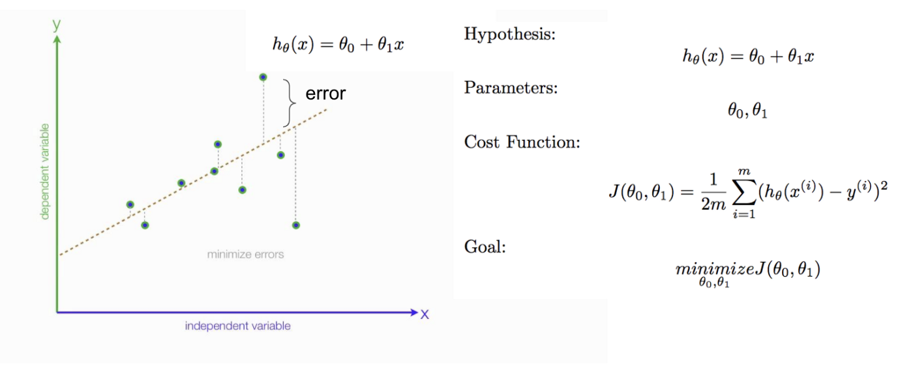
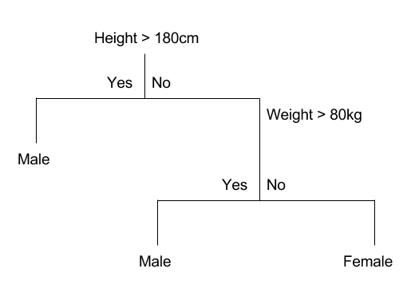
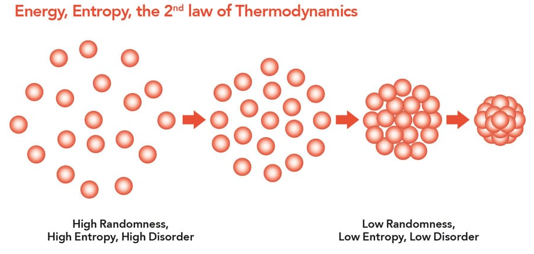

<!-- markdownlint-disable-->

**TLDR**: Gini impurity and entropy are similar in most cases, however, in practice you may find that gini impurity is faster as log values do not need to be computed. 

##### Introduction

Machine learning algorithms can be complex but in simple terms, training a machine learning model is essentially an optimization problem where training is performed to find model parameters (i.e. weights and hyperparameters) that reduce the cost function.

The cost function is the summation of the loss function across the entire dataset. The “loss” is the error from the true value (i.e. target) to the model’s predicted value, for example, the root mean squared error for regression or binary cross-entropy loss for classification problems. Obviously, the aim is to have a model that accurately predicts the target value for the majority of the dataset (or be as close to as possible for regression), therefore, the aim is to minimise the cost function tuning the weights using gradient descent. This is why training a machine learning model takes a while, especially for complex datasets that are within multiple dimensional spaces.

The decision tree, however, does not use gradient descent but rather, uses a different approach. Read on to find out more! 

#### Decision Tree
The decision tree regressor or classifier, as the name suggests, consists of a decision tree. Random forests are one of the most popular machine learning ensemble models. This stems from the versatile nature of decision trees, its white box nature and feature analysis capability. Understanding how decisions are being made within the decision tree can help establish which features are important. 

Decision trees essentially have an automatic feature selection process and features no longer require a standardisation process. 

This article is purposely limited and only discusses information gain. There are other key concepts to consider when creating a decision tree. Therefore, at the end of this article, I introduce concepts which will be the subject of future blogs. 

#### Information Gain

The “tuning” of the decision trees does not use gradient descent to find its optimized parameters. Rather, it uses binary splits, for example, yes/no questions, greater than or less than values, to split the data at each node until the data reaches a leaf - this being the final target value. You may ask how does a model split the data efficiently? This is done by maximizing the information gain. 

The generic information gain formula, can be simplified into the information gain formula specific for binary splits, as shown here: 

$$
I_G (D_p, f) = I(D_p) - \displaystyle \sum_{j=1}^{m} \frac{N_j}{N} I(D_j)  =  I(D_p) - \rac{N_{left}}{N} I(D_{left}) - \frac{N_{right}}{N} I(D_{right})
$$

$ I_G $ is the information gain, $f$ is the feature to perform the split, $ D_p $ and $ D_j $ are the datasets for the parent and the $j^{th}$ child nodes, respectively. $N$ is the total number of samples, and $N_j$ is the number of samples within the $ j^{th} $ child node. $I$ is the impurity measure is a formula based on the selected splitting criteria.

From the equation, it is clear that the impurity measure, $I$, aids in maximizing the information gain; meanwhile, the impurity measure for either the left, right or both, nodes need to be minimized. The two commonly used splitting criteria are the Gini Impurity and Entropy. 

> Another impurity measure, not discussed here, is the classification error, but this is not a recommended option for growing trees. This error is preferred for pruning rather than performing binary splits. 

#### Entropy
The term entropy does come up a lot, but this is very similar to the definition you would find in Physics! 

> Entropy is a measure of the energy dispersal within a system. Entropy is greater when there is more random movement within the molecules and zero when absolute zero. 

Similarly, for machine learning, a larger entropy is observed when there is maximum randomness, such as predicting a head and tails coin toss - it is a complete chance! Meaning, when a binary split is performed using a feature that results in a large entropy it implies the feature, or threshold, is poor. 

> … information gain, is simply the expected reduction in entropy caused by partitioning the examples according to this attribute. As quoted by [Tom M. Mitchell's book](https://www.amazon.com/Learning-McGraw-Hill-International-Editions-Computer/dp/0071154671/ref=as_li_ss_tl?keywords=machine+learning&qid=1563151324&s=books&sr=1-44&linkCode=sl1&tag=inspiredalgor-20&linkId=5488f209b18fb6b8ad8ce7f72d1c3ac5&language=en_US).

Entropy impurity formula: 

$I_H (t) = -\displaystyle \sum_{i}^{C} p(i|t) log_2 p(i|t)$, for all valid classes meaning $p(i|t)$ cannot equal zero. 
$p(i|t)$ is the proportion of the samples that belong to class $c$ for a particular node $t$. 

From looking at the formula:

- the entropy is $0$, when all samples at a node belong to the same class, and, 
- at its maximum when samples at a node belong to an uniform class distribution (i.e. 50-50).

If you require a worked example, then i would highly recommend going through [this](https://machinelearningmastery.com/information-gain-and-mutual-information/) worked example. 

#### Gini

Gini impurity is easier to understand and can be grasped by just looking at the Gini impurity formula: 

$$
I_G (t) = \displaystyle \sum_{i=1}^{C} p(i|t)( 1- p(i|t)) = 1 - \displaystyle \sum_{i=1}^{C} p(i|t)^2
$$

From looking at the formula we can conclude:
- when $p(i|t)$ is minimized the gini impurity is far greater,
- the impurity is maximal if the classes are perfectly mixed, and,
- minimize the probability of misclassification.

#### Conclusion

Both of these formula are similar by using the $p(i|t)$ term but differ computational because of the additional logarithmic function. Moreover, from the formula we can see that the range of entropy lies in between 0 to 1 and the range of gini impurity lies in between 0 to 0.5. Therefore, we can conclude that gini impurity is most often superior compared to entropy for selecting the best features but as with all projects, it depends on the data you have. Most often the gini impurity and entropy performance is similar and does not warrant the additional time to train on both. 

Regardless of the impurity criteria selected, decision trees have an automatic feature selection process. Whereby, the impurity reduction has to be large enough to warrant the use of the feature. In a wider perspective, decision trees should be a small part of an ensemble model, either through gradient boosting, stacking, voting etc., as they independent from other gradient descent based models.

***Note: The Greek symbols may not render in your browser.***

 

--- 

** If you are interested in more data science topics then check out my other blogs [here](./).**
