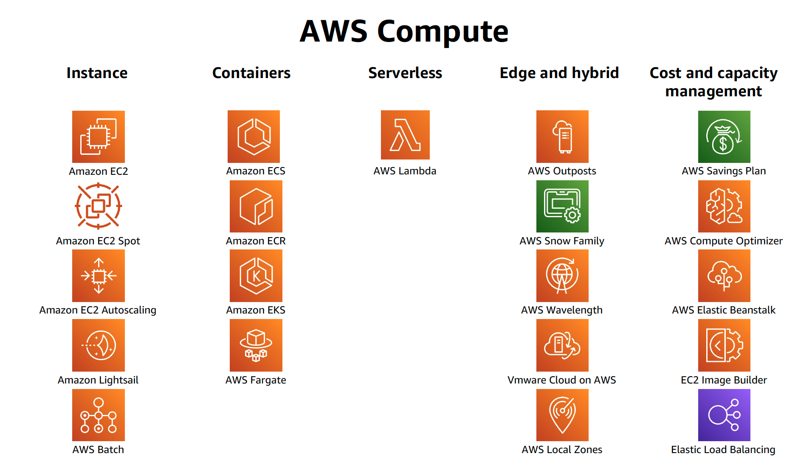

AWS has many offerings that can be customized for any application, whether it be supporting a website, bank or even a coffee shop! AWS has something for everyone. As data scientists, it is really important to be able to figure out which services you would need - especially, if you are a data scientist team of one!

I understand that AWS console can be overwhelming, particularly if you are just getting started with cloud infrastructure. However, most applications only require a handful of services! For example, I wouldn't recommend setting up an [AWS Direct Connect](https://aws.amazon.com/directconnect/) when you're hosting blog (the tech nerds would understand that joke). In layman terms, there is no need to buy a Tank when a Toyota would do just fine most of the time. But when you're moving home, you might need a Truck/Lorry/Van, so on those days you can just hire them and only pay for how long you used them. These principles apply to cloud infrastructure too. 

This blog is not a comprehensive step-by-step guide on how to use and set up each of the services. There are many blogs that goes into the minutiae of these services. This is not that blog. Instead this blog provides a list of popular services and a brief description of each! Having a single place (and page) to compare the name and their descriptions can help build an overview picture of what AWS has to offer.

## Compute

**Amazon Elastic Compute Cloud (EC2)**: provides resizable on-demand compute capacity in the cloud. We can customise instances based on OS versions, hardware configurations and based on your application requirements. The requirements may include compute, memory and storage. There are specific instance types:
- General purpose: provides a balance between compute, memory and network resources.
- Compute Optimised: ideal for compute-bound applications which have high performance processors for compute intensive applications.
- Memory optimised: to deliver faster performance on workloads such as processing large datasets in memory. It stores the data in a temporary storage area and then processes it in the CPU. 
- Accelerated compute: aids in workloads that use graphic applications, game streaming and application streaming. It uses hardware accelerators to perform some functions more efficiently that running on CPUs. 
- Storage optimised: designed for high, sequential read and write access to large datasets on local storage.

**Amazon EC2 Auto Scaling**: enables EC2 instances to have auto scalability functionality with the ability to increase the number of EC2 instances when demand increases.

**Amazon Elastic Load Balancing**: distributes incoming application traffic across multiple resources such as EC2 instances. It is a single point of contact for all incoming traffic to the Auto scaling group.

**Amazon Lambda**: (my personal favourite!) allows us to run code without needing to provision or manage servers. You only pay for what time it takes your code takes to run!

**AWS Elastic Container Service (ECS)**: is scalable, container management systems that allows us to run and scale containerized applications on AWS. It supports Docker. 

**AWS Elastic Kubernetes Service (EKS)**: is similar to ECS but supports Kubernetes.

## Messages 

**Amazon Simple Notifications Service (SNS)**: a publish/subscribe service where subscribers can be web servers, email addresses and AWS Lambda functions.

**Amazon Simple Queue Service (SQS)**: is a message queuing service to allow us to send, store and receive messages between software components.

## Networking 

**Amazon Virtual Private Cloud**: We need to have the ability to restrict the amount of data being allowed to flow through our EC2 instances. Amazon VPC services establishes boundaries around AWS resources and restrict network traffic to flow through it. We would need to set up Security Groups (stateful and deny all inbound traffic by default) and Network Access Control list (ACLs are stateless and denys all inbound and outbound traffic). 

**Virtual Private Gateway**: establishes connection with a VPN, this connection can be between you VPC and private network (i.e. on premises data centres).

**AWS Direct Connect**: a service that enables you to establish a dedicated private connection between your data center and a virtual private cloud (VPC). This service offering is typically for customers that require an extremely secure direct connection as data does not flow through the internet. 

**Amazon Route 53**: is a Domain Name System (DNS), and gives the ability to route end users to internet applications. 

**Amazon CloudFront**: a content delivery network allows to the ability to cache content closer to your customers.

## Storage

**Amazon Elastic Block Store (EBS)**: a virtual persistent block level storage volume that we can attach to our EC2 instances within that single availability zone - even after we stop and start multiple instances. Blocks are good for large files where large changes are likely to be made.

**Amazon EBS Snapshots**: allows for an incremental backup. Like Mac's Time Machine system, we back up only the blocks that have changed since the most recent snapshot.

**Amazon Simple Storage Service (S3)**: a managed object level storage service. There are types of S3 storage based on how frequently you need to access the data and how available you need your data. You should also consider how many back ups and set permissions to control visibility and access to those objects.

**Amazon Elastic File System (EFS)**: is a linux file system and allows you to reading and write simultaneously, while having the added benefit of scaling. EFS grows and shrinks automatically. This solution is a regional service and we can access these files across multiple availability zones.

## Databases

**Amazon Relational Database Service (RDS)**: a service that allows the ability to run relational databases in the cloud. 
By storing our databases in the cloud we no longer need to spend hours (or days!) maintaining the databases. RDS is available in six database engines:
- PostgreSQL
- MySQL
- Oracle
- Microsoft SQL Server
- Amazon Aurora: specially built for the cloud and has full MySQL and PostgreSQL compatibility but faster and with increased availability by backing up data on S3 and 3 availability zones.

**Amazon DynamoDB**: a serverless database so we do not need to manage the database or scale the system. It is a non-relational database and has a flexible schema, being queried using key value pairs. On Amazon Prime Day these tables are called millions of times per second. 

**Amazon RedShift**: is data warehousing as a service that you use to perform big data analytics. You can run a single SQL query against exabytes of data. 

**Amazon Database Migration Service**: allows you to securely migrate your database from your database to your AWS database.

There are many more other types of database that AWS offers but these are the most popular and most applications will fall under these.

## Security

AWS controls the security of the cloud, while we are responsible for security in the cloud. We must be able to defend ourselves from Denial-of-Service attacks (DDos).

It is the responsibility of AWS to make sure that the physical infrastructure, network and the hypervisor is secure.

Meanwhile, we must ensure that the operating system, application and data is secure. AWS offers many types of encryption for data being stored (encryption at-rest) and transported (encryption n-transit) by using cryptographic keys.

AWS will never ask for the OS key to our EC2 instances, if that happens they are not AWS!

**AWS Identity and Access management (IAM)**: tool to help define roles, groups, and actions that individual users can do on resources. A user is granted access only to what they need - Principle of Least Privilege. Fortunately, AWS has IAM Groups where you can define a policy across the entire group.

**AWS Organisations**: lets us set permissions for accounts by configuring service control policies (SCPs).

**AWS Artifact**: on-demand access to the AWS security and compliance reports and select online agreements.

**AWS Shield Standard**: automatically protects our applications at no cost to us! We are protected for DDoS attacks being protected by AWS resources! 

**AWS Shield Advanced**: allows us to stay protect against sophisticated DDoS attacks and integrates well with other services such as Amazon CloudFront, Amazon Route 53, and Elastic Load Balancing. For a DDoS attack to overwhelm those services would require a huge number of resources. We can customize the AWS Shield with AWS WAF by writing custom rules to the mitigate complex DDoS attacks specific to our application.

**AWS Inspector**: runs an automated vulnerability and security check, and recommends remediation to solve these risks. 

## Monitoring and Pricing 

**AWS CloudWatch**: lets us monitor our AWS resources in one central location giving us metrics, logs and alarms in a system wide level. We can reduce meantime to resolution (MTTR) and improve total cost of ownership (TCO). For example, you can set up alarms when developers forget to switch off their EC2 instances by notifying you when CPU utilization percentages remains below a threshold for a certain length of time.

**AWS CloudTrail**: keeps a record of all AWS API calls for your account and keeps a "trail" of logs for each call. We can find out who made the call, source IP addresses, time of the call, name of API caller and many more useful insights to track down any security and cloud issues.

**AWS Trusted Advisor**: is a web service that provides recommendations on our AWS environment on AWS best practices. It looks like cost optimization, performance, security, fault tolerance and service limits. The advisor is an automated tool that inspects our AWS account and suggests improvements we could make on each of the 5 categories.

# Conclusion

These are just some of the services that AWS offers. Wrapping your head around all of them can be tough, but the best way is to create something with it. Use Lambda Functions to get data and store it in a S3 bucket before querying it with AWS Athena and visualizing the results in AWS QuickSight. Check out my blog post on getting data [here](/get-data-using-boto-3).

AWS are constantly coming out with new tools and services. The driver for this is to increase the possible use cases and the niche solutions that some applications require. There are many new tools and it is almost impossible to become familiar with all of them to a high standard but once we understand a handful of the services we can learn new tools easily. Good luck! 
