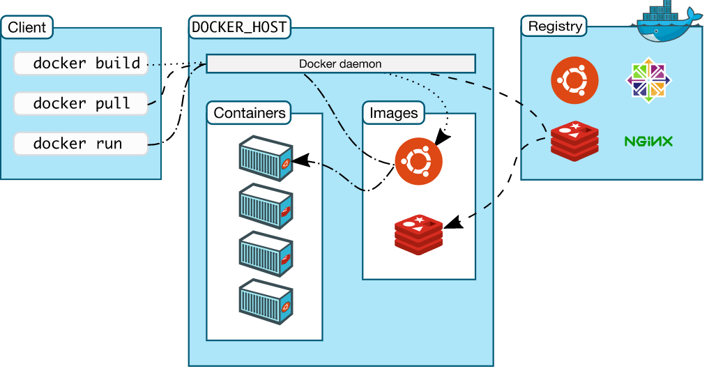
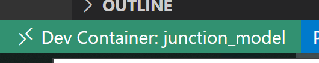
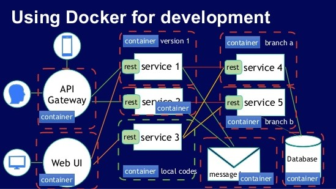

<!-- markdownlint-disable-->

**TLDR**: Anaconda is good, but Docker offers many more benefits. You can configure Docker to allow live development within a container. This will let you to get up and running in a consistent development environment without having to worry about your local machine. Visual Studio Code Remote Development extension allows you to use a container, remote machine, or the Windows Subsystem for Linux (WSL) as a full-featured development environment.


## Introduction

Following on from [Starting with Package Managers](./starting-with-package-managers) Anaconda post. It is crucial to start learning Docker once you have an understanding of how virtual environments work. Anaconda is a great package manager for data scientists, but you will find that it is difficult to reproduce individual environments. Consequently, sharing code can then lead to the "*does not work on my computer*" problem to occur.

These problems arise from different builds, operating systems and, in my case, Windows 10 editions (at the time of writing there are 12 different editions). This is particularly susceptible if you have configured Anaconda with various channels and priorities, such as the `conda-forge` channel. You will also need to share your `conda config file` with your team.

These problems can be solved by using Docker! Where you will get the "*it does work so how long till we can deploy?*" problem. **Deploying is a whole new field, more on that in future posts!**

## About Docker 

Docker is an open platform that allows you to develop applications, in our case a data science project, in an isolated environment called a container. These containers can be shared easily with colleagues. Docker is lightweight, portable, and can easily be scaled quickly in cloud computing services as either Infrastructure as a Service (IaaS) or Platform as a Service (PaaS) - more blogs on cloud computing services to follow. These containers consist of Docker images.



### Terminology

##### *Docker Image*

A Docker image consists of instructions on creating a Docker container. The images can be customized to suit your needs by specifying a `Dockerfile`. Each line within the simple syntax is an instruction and considered a layer within the image. Note, you should limit the number of layers an image has to speed up the build time. Docker's [documentation](https://docs.docker.com/develop/develop-images/dockerfile_best-practices/) and [this](https://www.youtube.com/watch?v=Z1Al4I4Os_A) PyData talk, give great insight into speeding up your build time and the best practices on using the `Dockerfile`. 

##### *Container*

As mentioned, a container is a runnable instance of an image. You can connect and control multiple containers to multiple networks. The container does not change state and any changes will not be saved. Therefore, the only way to change a container is through the images, or, configuration options used to create or start the container. In this case, changing the configuration options to enable Docker to run as a development environment. 

##### *Docker Client*

The Docker client talks to the Docker Daemon, (i.e. requests via `Dockerfile` or `docker-compose.yml` file), which builds and distributes the containers. The Docker client can also talk with other daemons. The Docker Daemon also talks with the registry, called Docker Hub - think of it like GitHub but for Docker. It contains Docker images that you can `pull` and `push`. You can even `pull` a fully working Anaconda image:

```bash noLineNumbers
docker pull continuumio/anaconda3
```
This image will contain all the python packages you need for most data science projects - providing access to more than 700 python and R packages. You will also be able to use Anaconda environments too! Read more about it on [Anaconda's Docker Hub page](https://hub.docker.com/r/continuumio/anaconda3). 

##### *Docker Volumes*

There are two options to store files in containers. This is so that the files persist even after the container stops: volumes and bind mounts. Understanding the difference between the two is out of the scope of this blog post but here is a quick summary.

Volumes are good for persistent data, data that does not change, unlike dynamic data that would require bind mounts or [tmpfs](https://docs.docker.com/storage/tmpfs/). Volumes and bind mounts are completely different and should be used properly, I recommend reading:
- [Use bind mounts](https://docs.docker.com/storage/bind-mounts/)
- [Use volumes](https://docs.docker.com/storage/volumes/)
- [Docker Documentation](https://docs.docker.com/get-started/overview/)

In the case of using Docker as a development container, volumes are used so source code from your local machine can be read, written and saved back onto the local machine. *Note, this is different to copying files as a layer, (i.e. written with the `COPY` command within the `Dockerfile`), into the container.*

## Getting Started with Docker

I would really recommend reading the 10-part guide called [How to get started with Docker](https://docs.docker.com/get-started/). Docker is really well documented, with plenty of resources on YouTube. The following YouTube videos will give you a great background:

- [Docker Beginner Video](https://www.youtube.com/watch?v=iqqDU2crIEQ): How to get started with Docker
- [Container Building in Go](https://www.youtube.com/watch?v=8fi7uSYlOdc): Building containers from scratch using Go
- [2-hour Docker course](https://www.youtube.com/watch?v=fqMOX6JJhGo): Overview of Docker
- [Docker for beginners](https://www.youtube.com/watch?v=i7ABlHngi1Q): Basic command line arguments

I went through all of the above before I wrote my first `Dockerfile` and would highly recommend doing the same.  

The below python app example is based on Docker's [python guide](https://docs.docker.com/language/python/build-images/).

##### Python App Folder

Lets practice by creating an image. This can be done by using a `Dockerfile` within the current working directory, where your app files are located.

First, change the current working directory to your python app folder, `python-docker`: 

```bash noLineNumbers
cd /path/to/python-docker
```
<br/>

##### Code App
Create a file called `app.py` and, `pip freeze` a `requirements.txt` file, in this case just `Flask==1.1.2`, within the `python-docker` folder. With the following python script:

```py
# app.py 
# import flask module
from flask import Flask

# build flask app 
app = Flask(__name__)

# set current working directory
@app.route('/')

# test function to print if container is working
def hello_world():
    return 'Hello, Docker! If you can see this, then a Docker container is running.'
```

<br/>

##### Dockerfile

Now that you have your basic Flask application, you need to create a `Dockerfile`. This builds the image to run your app. I recommend using Visual Studio code's Docker extension. The `Dockerfile` will include the following:

```typescript 
# build python as a base image
FROM python:3.8-slim-buster

# instruct Docker to use /app path as the default location
WORKDIR /app

# COPY local requirements file into /app
COPY requirements.txt requirements-app.txt

# install the requirements file by using the RUN command
RUN pip3 install -r requirements-app.txt

# COPY local app files into /app 
COPY . .

# tell Docker what command to run when an image is executed inside a container
CMD [ "python3", "-m" , "flask", "run", "--host=0.0.0.0"]
```

<br/>

##### Images

Now that you have created the app and `Dockerfile`, you need to build the Docker image with the following commands:

```bash noLineNumbers 
docker build --tag python-docker .

OUTPUT: [+] Building 2.7s (10/10) FINISHED
```
This took around 2.7 seconds to build. The `-t` flag allows you to name and tag a docker image, in this case `python-docker`. Make every effort to clearly label and tag your images, just as you would with conda environments.

Using the command line, you will have an image repository named `python-docker`. Run the following:

```bash noLineNumbers
docker image ls
```

This lists all the images within your local machine with a few extra details. You can create another image, based on the `python-docker` image, with a different tag by running:

```bash noLineNumbers 
docker tag python-docker:latest python-docker:v2
```

This may be the preferred approach if you want to use this image as a base image and add layers onto it. Making multiple copies of images is very easy, with virtually no run time. This is probably why Docker is easily scaled. 

You can remove images by running:

```bash noLineNumbers 
docker rmi python-docker:v2
```

<br/>

##### Containers

The `python-docker` image has now been created. The next step is running a container. To do this, you need your local host to “connect” to the container. For this, you will need to specify the port number, via the `-p` flag. Otherwise, the container will run and not be "exposed" to your local machine. Consequently, there will be no "connection" into the virtual machine.


As mentioned, it is always good to name your images, but you should also name containers. Do this with the `--name` flag. Otherwise, Docker will randomly allocate an unique name for you. 

```bash noLineNumbers
docker run -p 8000:5000 python-docker --name python-container
```

This will map the host’s port 8000 to the container’s port of 5000. You will notice that you can no longer use the command line and you will have to press `ctrl+c` to stop the container.

To view all *running* containers, you can either use Docker desktop or run the following in the command line:

```bash noLineNumbers
docker ps
```

You will not see the previous containers, as it is no longer running. Add the `-a` flag to see all containers, including exited ones:

```bash noLineNumbers
docker ps -a # see all containers including stopped containers
```

You might have noticed that running the container prevents you from using the command line. This can be avoided by detaching from the container. Just add the `-d` flag when running the container.

**Overall, it is efficient to run a container using the following commands**:

```bash noLineNumbers
docker run -d -p 8000:5000 --name python-container python-docker
# docker run -d -p host-port:container-port --name <container-name> <image-name>
```

This creates a container that is running and detached in the background; moreover, you can see the output at port 8000 on `http://localhost:8000`. If you see a http webpage with the output from the `hello_world` function, written within the `app.py` file, then you have successfully completed the steps and are running the application within a container.

```noLineNumbers
# http://localhost:8000
Hello, Docker! If you can see this, then a Docker container is running.
```

To stop the container, `ctrl+c` can no longer be used, instead, use either the `container_ID` or the `container name` given in `docker ps`. You can also stop the container via Docker Desktop.

```bash noLineNumbers
docker stop <container name/ID>
```
*Note, you do not have to specify the entire `container_ID`. The first 4 or 5 characters should be enough. *

If you would like to stop all running containers you can run the following, with the `-q` flag.

```bash noLineNumbers
docker stop (docker ps -q)
```
<br/>

##### Docker Compose

Passing multiple parameters to the `docker run` command can slowly become repetitive, which is why using a `Compose` file can help run your container(s) with their volume(s) in a single command. After building a compose file, you can run the following command to run it.

```bash noLineNumbers
docker-compose -f <name-of-docker-compose-file> up --build
```

To stop it run the following:

```bash noLineNumbers
docker-compose -f <name-of-docker-compose-file> down
```

The `docker-compose`, `up` and `down` commands are used with compose files. You no longer need to build or run. Simply use the `up` and `down` commands with the `-d` flag, if required.

Example `docker-compose.yml` file:

```coffeescript
# docker-compose.yml
version: '3.8'

services:
 web:
  build:
   context: .
  ports:
  - 5000:5000
  volumes:
  - ./:/app
```

The `docker-compose.yml` can become more complex than the example above. The file also forms the foundation for connecting to multiple containers, allowing you to run multi-container Docker applications. Think of multiple databases or web applications such as [Streamlit](https://streamlit.io/) or [Dash](https://plotly.com/dash/) - more on this on another blog.

This separates your services into isolate environments but still allows them to run together. The application's configuration can be specified within the `docker-compose.yml` file. Then, with a single command, you create and start all the services from your configuration.

More details on this can be found on [Docker's documentation](https://docs.docker.com/compose/).

## Development Container

If you have got this far, then well done! 

Now that you understand how Docker works, you probably see the problem of developing inside a container without having to continuously rebuild it. Meaning, when you changed your `app.py` file locally, it did not automatically update those changes. You had to rebuild your image and then run your container. This can be a long process for small changes.

What we require is a full-featured development environment. Whether you deploy to containers or not, containers make a great development environment - far superior than using Anaconda! Yes, this can be done by using volumes but rather than having to manually configure the container, you can download the Visual Studio Code extension [Remote Containers](https://marketplace.visualstudio.com/items?itemName=ms-vscode-remote.remote-containers).

This automatically builds a container from a folder and allows you to carry out live code changes, ultimately, being reflected within the container. Moreover, when you change your `app.py` file locally the container application changes too. Just as it would if you were developing code on your local machine. This approach is far easier than having to worry about your local machine ruining the reproducibility of your code.  

#### Devcontainer Folder

To get started, create a `.devcontainer` folder inside your project folder. Within the `.devcontainer` folder create a `dev-container.json` file.

The file is pretty simple and here is an example:

```json
// dev-container.json
{
    "name": "junction_model",
    "build": {
        "dockerfile": "./Dockerfile",
        "context": "..",
    }
}
```

In this case, the container's name will be `junction_model`. There are many more options that you can input, please refer to the [devcontainer documentation](https://code.visualstudio.com/docs/remote/devcontainerjson-reference).

Another feature is being able to have all the extensions you desire within the container - including all those life saving intellisense extensions! This can be done by amending the `devcontainer.json` file and inputting an array of extension IDs into the extension argument. 

*Note, how many Visual Studio defaults are being set while creating the development environment - mostly to enable linting.*

An example `devcontainer.json` file is:
```json
// devcontainer.json
{
    "name": "junction_model",
    "build": {
        "dockerfile": "./Dockerfile",
        "context": "..",
    },
    // Set *default* container specific settings.json values on container create.
    "settings": { 
        "terminal.integrated.shell.linux": "/bin/bash noLineNumbers",
        "visualstudioexptteam.vscodeintellicode" : true,
        "python.pythonPath": "/usr/local/bin/python",
        "python.linting.enabled": true,
        "python.linting.pylintEnabled": true,
        "python.formatting.autopep8Path": "/usr/local/py-utils/bin/autopep8",
        "python.linting.banditPath": "/usr/local/py-utils/bin/bandit",
        "python.linting.flake8Path": "/usr/local/py-utils/bin/flake8",
        "python.linting.mypyPath": "/usr/local/py-utils/bin/mypy",
        "python.linting.pycodestylePath": "/usr/local/py-utils/bin/pycodestyle",
        "python.linting.pydocstylePath": "/usr/local/py-utils/bin/pydocstyle",
        "python.linting.pylintPath": "/usr/local/py-utils/bin/pylint"
    },
    // Add the IDs of extensions you want installed when the container is created.
    "extensions": [
        "ms-python.python",
        "ms-vscode-remote.remote-containers",
        "ms-toolsai.jupyter",
        "visualstudioexptteam.vscodeintellicode",
        "eamodio.gitlens",
        "ms-azuretools.vscode-docker"
    ],
}
```

For clarity, the `Dockerfile` does not change much. In the file below, I am not running a flask app instead, just source code inside of a container:

```typescript
FROM python:3.8-slim-buster

RUN mkdir /project

WORKDIR /project

COPY .devcontainer/requirements.txt /tmp/pip-tmp/

RUN pip --trusted-host pypi.org install --trusted-host files.pythonhosted.org -r /tmp/pip-tmp/requirements.txt
```

Docker is extremely versatile. The above `Dockerfile` shows the `pip` flags that can be used in order create the image. In this case, if you have `SSL` errors, from a company firewall, then setting the `--trusted-host` parameter is a good approach to bypassing it.

##### Create Development Container

Once you have the `.devcontainer` folder, `devcontainer.json`, and `Dockerfile`, you can now build the development container. Click on the extension at the bottom left. When you are within your local machine you will only see the symbol, while when you are inside the container you will see the container name.



You can now select the option you require. In this case, I have edited all the files so will now rebuild the container:


Your source code is outside of the container, (i.e. within your local machine), so you no longer have to rebuild the container for small code changes. You only need to rebuilt it when you make changes to Docker related files. If you use Anaconda as a base image, then you won't need to do that much.



**Recommended Material:**
- Further reading: [Microsoft Developing Inside a Container](https://code.visualstudio.com/docs/remote/containers) 

- PyData video: https://www.youtube.com/watch?v=gBalsA-x300 


## Summary
You can now develop code without the "does not work on my machine" problem! Developing code in a container ensures that your data science projects are consistent, easily reproducible and scalable.

Give it a try! 


<br/>

--- 

** If you are interested in more data science topics then check out my other blogs [here](./).**
