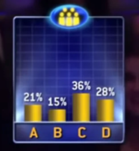
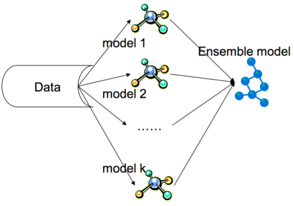
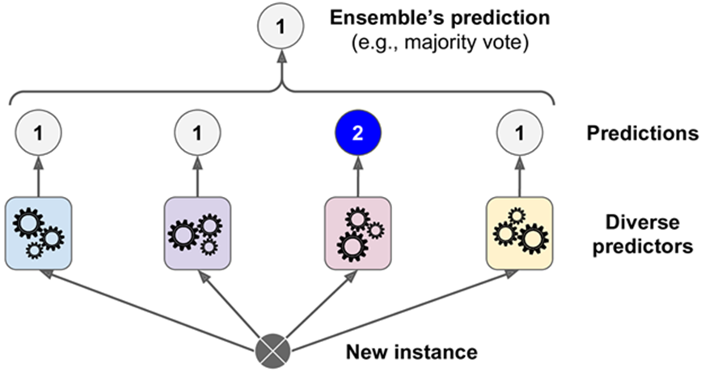
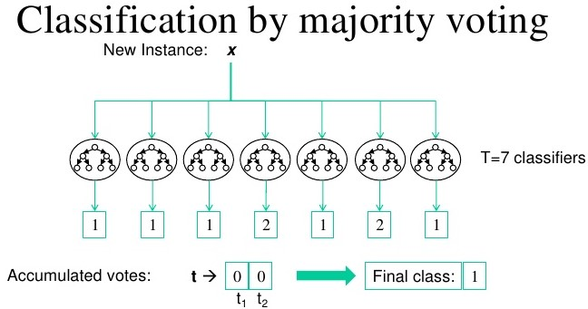

*This blog is part of the short blog series, where I will give a brief insight on various key topics within data science.*

This article describes the concept of the Wisdom of the Crowds and how we can reflect and apply this theory when creating machine learning models. Ensemble methods find their origins in the principle of Wisdom of the Crowds. Typically, this results in an improved model which is better than the individual models within the ensemble.

> The Wisdom of the entire crowd is better than the wisdom of the wisest individual within it.

You have probably seen a game show, if not then Google [Who Wants to be a Millionaire](https://youtu.be/SpzZBYTdQO8?t=104). The show has an option, where the contestant can ask the audience and, most often, majority of the audience would get the question correct. However, there are a few exceptions where majority of audience gets it wrong and the contestant is none the wiser.

This could have been because one row of the audience just copied each other, or, carried out the exact same methodology in answering the question. Similar to how an entire class of pupils get the same question wrong because of that one awful teacher that showed them the incorrect way to approach algebra!

To avoid this outcome, we could split the audience so that they cannot copy each other, or offer pupils different teachers. This will allow the audience to think independently from one another and allow a decentralised approach to solving problems to pupils.

This is exactly how an Ensemble model, that contains different types of machine learning models, works. Furthermore, because each model are trained using different algorithms we can be sure that each model is independent and decentralised.

For example, rather than having 3 logistic regression models within the Ensemble, you should create 3 independent models that have different learning algorithms, such as a Support Vector Machine (SVM), Decision Tree and Logistic Regression. You can even add other complex ensemble models such as Bagging, Boosting and Random Forests together. A final meta-estimator can then be trained which takes the output of these models as its input and provides a final prediction.

An example of an ensemble model is shown on the image below using the [MNIST Digit dataset](https://www.kaggle.com/c/digit-recognizer) - * I have produced a CNN model that came in the top 15% in the Kaggle competition - [see here](https://www.kaggle.com/ashishthanki95/competitions)*. As you can see, some classifiers have predicted the value of 2, however majority of the models within the ensemble has correctly predicted the value of 1. Therefore, the final model predicted 1.

### Summary

Many of the winning models within Kaggle competitions are Ensemble models and why it is crucial to understand them. There are many types of Ensemble models such as Stacking, Boosting and Bagging that are worth exploring. A great read on all of them can be found on [Sci-kit learn](https://scikit-learn.org/stable/modules/ensemble.html).

Although, training time is increased significantly, because of the increased number of models and the final meta-estimator, it is outweighed by the benefit of improved model performance. However, model interpretation is often very difficult as these ensemble models are black boxes and are not open to interpretation. Models like Decision Trees can easily be interpreted and a good understanding on why a certain prediction was made. SHAP values, permutation importance and partial dependence plots are extremely useful - read more [here](./Interpreting-ML-Models) - and why they come in handy when interpreting complex ensemble models.

Nonetheless, there is exciting research being carried out on enhancing the benefits of Ensemble models, which uses wisdom of the crowds theory, such as [this paper](https://arxiv.org/ftp/arxiv/papers/1605/1605.04074.pdf) and [this blog post](https://machinelearningmastery.com/what-is-ensemble-learning/).  Ensemble models are constantly the winners in competitions and why you should look into creating them for your projects! 

###### References:

- *Chapter 3 The Art of Science by D. Speigelhalter.*
- *Chapter 7 Hands-on Machine Learning with Scikit-Learn, Keras, & TensorFlow by A. Geron*
- *Investopedia: [Wisdom Crowds](https://www.investopedia.com/terms/w/wisdom-crowds.asp)*
