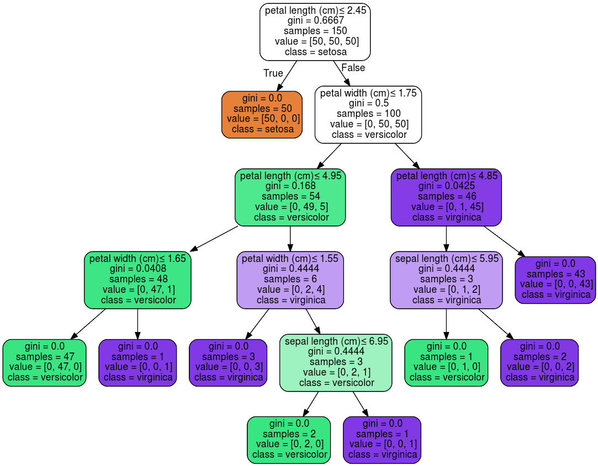
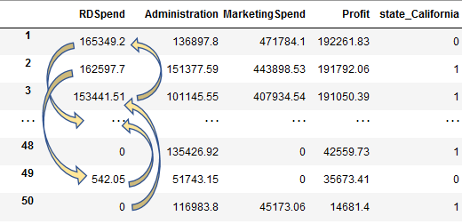
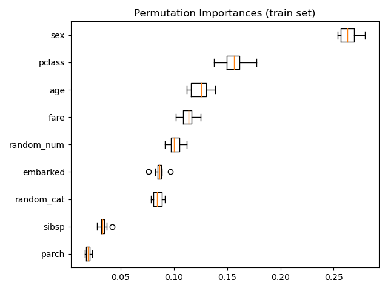
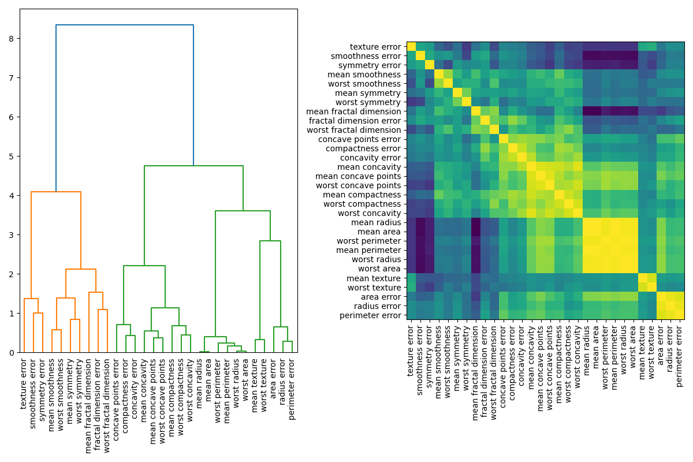
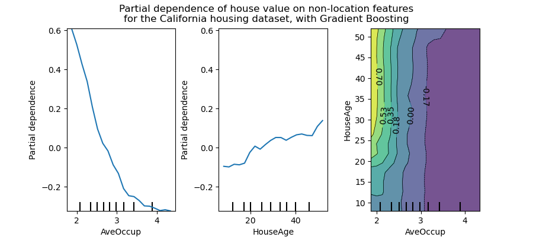
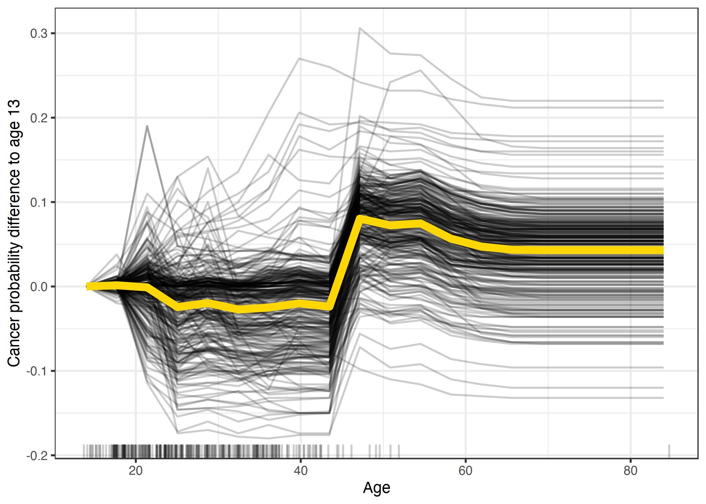

<!-- markdownlint-disable-->

# Introduction

Explaining features and interpreting your models has taken a sharp rise in Europe. Partly because of new laws and regulatory measures being taken, such as GDPR and the EU’s "[Right to Explanations](https://en.wikipedia.org/wiki/Right_to_explanation)", alongside the rise in interest in applying machine learning. This has mandated data scientists to explain why a model has given a certain prediction. For example, institutions with highly sensitive data (i.e. personal data), that have models that output a potentially life changing decision would mandate regulations and require the data scientists to explain the decision that had been made. Hence, this blog post on model interpreting.

This blog is part 1 of a 2 part series where this blog covers Feature Importance, Permutation Importance and Partial Dependence Plots. The second part of this series covers SHAP and LIME, check it out [here](./interpreting-ml-models-part-2).

## Feature Importance

Machine learning models are often considered black boxes. Meaning, data goes in and a prediction comes out, with no understanding on how that decision was made.

There are many types of machine learning models with various algorithms. There are also many ways to interpret a model's prediction. A Decision Tree based model is one of the most popular, mainly because of its white box nature and that it can be visualized with useful modules like `graphiviz`.

Feature importance can be measured in multiple ways, for example, Decision Tree based models use the Gini importance - read [this](./gini-vs-entropy) blog post to understand what Gini impurity is. Once you have this you can plot it and see which feature is most important for the Decision Tree. For linear models, such as linear regression, the coefficients are used to establish whether a feature is important. Feature selection methods such as `l1` norm reduce dimensionality by selecting only non-zero coefficients. 

However, this can be misleading, particularly for high cardinality data (i.e. attributes with many unique values). Feature importance values will be greater for high cardinality attributes. A popular alternative, which can also be generalized for various machine learning models, is Permutation Importance. 

## Permutation Importance

Permutation importance (PI) is used for feature evaluation and is not biased towards high cardinality features. After fitting a model to the training data, we observe the score of the model when randomly shuffling a single column while keeping all other columns the same. This effectively makes the target value independent of the feature. Computation to calculate PI is more costly compared to impurity or coefficient based importance computations. 

We then calculate the reduction between the baseline score and the model score when shuffling a single column. If the shuffling leads to a worse model score then we know that the feature was important. However, if the feature was not important there would not be much of a drop in the model’s score. On the other hand, if you shuffled the sex column within the Titanic dataset, you would quickly realise that the [sex column was very important](https://scikit-learn.org/stable/auto_examples/inspection/plot_permutation_importance.html), because the model score would significantly decrease. Occasionally, you may find that there would be an unexpected increase in the score for columns you did not expect. In such instances random chance may have caused this. Further analysis should be carried out on the validation set (i.e. unseen data), or, an assessment of the correlation between features should be looked at - the [multicollinearity](https://scikit-learn.org/stable/auto_examples/inspection/plot_permutation_importance_multicollinear.html#sphx-glr-auto-examples-inspection-plot-permutation-importance-multicollinear-py).

Multicollinear, or correlated features, may return with PI values as zero, when in fact they are important once combined together - *think dividing or multiplying features to create a new feature*. When correlated features are apparent, within the dataset, you can cluster them by using the value calculated on the Spearman’s Rank correlation and then manually pick a threshold value to keep only those features from each cluster. 

Regardless of the PI value observed you should take your time to understand why you are obtaining this PI value. Just because a feature’s PI value is greater than other features PI values we cannot conclude that it is important. The PI does not tell us how each feature matters, if an attribute has an 'average' PI value then it could imply that the feature was not useful for many instances but large for others. This is not very helpful, which is why summary SHAP plots provide an even better solution - more on that later. 

*Note, the feature magnitude does not affect the PI, it will affect it indirectly through the machine learning model selected. For example, in Decision Tree based models scaling has no effect on the model score. However, with Gradient Descent based models it would.*

#### Further reading:
- [Plotting Feature Importance for Tree based model](https://scikit-learn.org/stable/auto_examples/ensemble/plot_forest_importances.html)
- [Permutation Feature Importance](https://scikit-learn.org/stable/modules/permutation_importance.html#permutation-importance)
- [Permutation Importance vs Feature Importance](https://scikit-learn.org/stable/auto_examples/inspection/plot_permutation_importance.html#sphx-glr-auto-examples-inspection-plot-permutation-importance-py)
- [Permutation Importance with Multicollinear or Correlated Features](https://scikit-learn.org/stable/auto_examples/inspection/plot_permutation_importance_multicollinear.html#sphx-glr-auto-examples-inspection-plot-permutation-importance-multicollinear-py)

## Partial Dependence 

Partial dependence plots (PDP) show the dependence between the target and a set of features, whereby we repeatedly change the value of the feature we are interested in. We are essentially plotting the target value response as a function of the feature of interest. We repeat this process for multiple rows across the dataset and plot the average of the outcome on the vertical axis (i.e. partial dependence ~ the change in the prediction).

PDP can be thought of as plotting coefficients for simple models like linear or logistic regression. For complex models, it captures more complex patterns. In complex models you will observe a smoother curve but in simpler models there will be more of a step. 

You can also observe and plot the interactions between features as a function of the target. For example, in the figure above, the `HouseAge` and `AveOccup` attributes, show that the `HousePrice` is independent of the house age when the average occupancy is greater than two. 

This level of analysis and understanding of a particular feature is not possible with Permutation Importance. Although, these plots are meaningless if features are correlated. PDP should typically be performed with the most important independent features and those of particular interest. 

Another downside to PDP, is Heterogeneous effects might be hidden because we can only see the average marginal effects. For example, for a given feature, if we observe lower predictions for low values and high predictions for high values then the PDP will show a horizontal line, implying that this feature is not important. Concretely, PDP show the average effect of a feature and does not focus on specific instances. This is where Individual Conditional Expectation (ICE) plots can help.

Individual Conditional Expectation (ICE) plots display one line per instance. It shows how each instance's prediction changes when a feature changes.

PDP plots work great to see the general trend of a feature plotted against the target. However, this aggregated line does not uncover heterogeneous effects so ICE plots can be helpful.

#### Further reading:
- [Plot Partial Dependence](https://scikit-learn.org/stable/auto_examples/inspection/plot_partial_dependence.html)
- [Kaggle Partial Plots](https://www.kaggle.com/dansbecker/partial-plots)
- [A Guide for Making Black Box Models Explainable By Christoph](https://christophm.github.io/interpretable-ml-book/pdp.html)

## Comparing PI and PD

Some of this might be overwhelming, so here are two sentences to summarise what each of these types of plots tell us:

- **Permutation Importance**: *Which* feature most affect predictions and can be used to establish which features are most relevant. 
- **Partial Dependence**: *How* a feature affects predictions and can be used to observe interactions between features.
 
*Note. These plots will not be helpful if there are correlated features.*

In some cases using both PI and PD is great, but assumptions should not be made about the and the features that you have. Exploration of each feature and understanding your data is critical in interpreting these plots. Furthermore, a good understanding of your model can help. Having a complex Stacked Ensemble model may result in smoother plots and may not give useful information. 

A simple statement to reinforce what we have learnt, if you understand this then you know what permutation importance and partial dependence is:
> If you have 2 features `X1` and `X2`, and a target `y`, where `y = X1 * X2`, then expect partial dependence plot to be flat while permutation importance to be high for both of the features.
