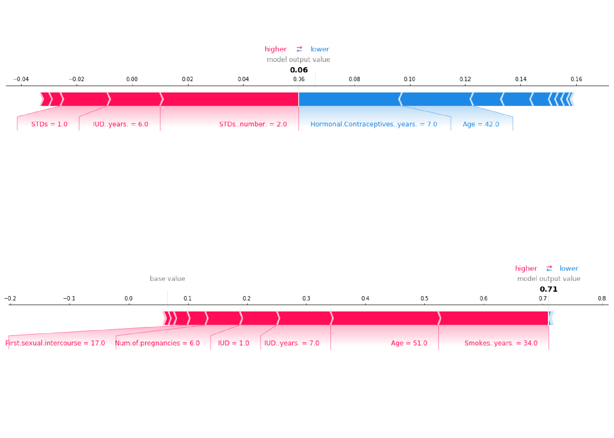

<!-- markdownlint-disable-->


# Introduction

Explaining features and interpreting your models has taken a sharp rise in Europe. Partly because of new laws and regulatory measures being taken, such as GDPR and the EU’s "[Right to Explanations](https://en.wikipedia.org/wiki/Right_to_explanation)", alongside the rise in interest in applying machine learning. This has mandated data scientists to explain why a model has given a certain prediction. For example, institutions with highly sensitive data (i.e. personal data), that have models that output a potentially life changing decision would mandate regulations and require the data scientists to explain the decision that had been made. Hence, this blog post on model interpreting.

This blog is part 2 of a 2 part series where this blog covers SHAP and LIME. The first part of this series covered  Feature Importance, Permutation Importance and Partial Dependence Plots, I recommend reading that first before this blog post, check it out [here](./interpreting-ml-models).

## Summary of Permutation Importance and Partial Dependence

By using Permutation Importance you can identify which features are important and then by using Partial Dependence plots you understand how the prediction varies based on the changes to individual features. But what if you want to know the *impact each feature has* on one specific prediction. This is where SHAP and LIME comes in, by using these techniques you will then be able to explain why a certain predicted value was reached and have a better understanding of your machine learning models.

## SHapley Additive exPlanations (SHAP)

SHapley Additive exPlanations (SHAP) is a game theory approach to explain the output of any machine learning model. SHAP can break down a prediction to show the impact of each feature. The SHAP explanation requires us to compute the shapley values from coalition game theory.

> The shapley value is a solution for computing feature contributions for single predictions for any machine learning model.

A shapley value is based on game theory. Each feature represents a “player” in the game and the prediction represents the pay-out. The distribution of the pay-outs are shapley values. The shapley values is a method that assigns payouts to features depending on their contribution to the model's prediction. The features cooperate in a coalition and receive a certain payout because of this corporation. The shapley value is the average marginal contribution of a feature's value when making predictions. 

...If that didn't make sense then I would suggest learning a bit more about Game Theory, once you do that replace the word “features” with “players” in the above explanation and it should click.





When a prediction is made, the summation of an instance's SHAP values for each feature explains why the prediction was different from the baseline. The baseline is the average shapley value for all predictions. If the SHAP value is large for a given feature than the contribution to the model's prediction is large. 


**WARNING**: The shapley value is not the prediction if we had removed a feature from the dataset. It is the average contribution of a feature value to a prediction across all possible coalitions.

However, the downside of calculating shapley values is the computational load. The number of coalitions can grow exponentially based on the number of features, and the number of iterations can contribute a large amount to the computational time. We handle both of these by taking a sample of coalitions and limiting the number of iterations both of which contribute towards the variance in the final shapley value. In effect, when we use Python libraries such as `shap` we are using estimations. 


### Estimating SHAP 

This leads very nicely to SHAP estimations. SHAP uses efficient methods to estimate the shapley values for a given machine learning model. There are 2 popular estimations `TreeSHAP` and `KernelSHAP`. 

- `TreeSHAP` estimates SHAP values for models that are decision tree based and,
- `KernelSHAP` is inspired by local surrogate models and can estimate other types of model but has its disadvantages.

*Computational complexity from `KernelSHAP` to `TreeSHAP` is reduced significantly, $O(TL^2M)$ to $O(TLD^2)$.*

The downside to `KernalSHAP` is that the kernel may be increase weightings for samples that are unrealistic. This is a common problem for permutation based interpretation methods. For example, changing either feature when a set of features are correlated, i.e. age and resting heart rate, could produce samples that are unrealistic. We would not expect a low resting heart rate high when the age is low. This will result in some features dependence being ignored.  

## Types of SHAP plots

The [`SHAP`](https://shap.readthedocs.io/en/latest/index.html) library is able to produce all the plots described below. It also has many other visualizations which are comparable to permutation importance and partial dependence plots.


### 1. Force Plots


A force plot shows, for a single instance, which features contribute towards pushing the model to a certain value. As you can see above the the feature values shown in blue are reducing the prediction value while the feature vales shown in red are increasing the prediction. 

### 2. Summary Plots


We can combine multiple force plots together and then rotate it to have a summary across the entire dataset. Summary plots show many useful insights into all the features, each dot shows three characteristics: 

- Vertical location is the feature it is representing.
- Color shows the magnitude of the feature value for that feature. 
- Horizontal location is the effect of that value causing a higher or lower prediction. 


In the plots you can gain a strong intuition on how a decision was made by your black box model. Some features will generally have no input in the prediction until a certain feature value, whereas some features will have zero input and is ignored entirely by the model. 


### 3. SHAP Dependence Plots


The SHAP dependence plots are used to identify how a feature magnitude affects the predicted value. You can then observe the general pattern (or not) on how the feature affects prediction.


Conversely, if there was large standard deviation, with no apparent pattern, then we can assume that other features are interacting with this feature. Similarly, if a feature has arbitrary values then it would lead to arbitrary predictions. For example, a binary feature within the dataset of value 0 could make the feature under investigation more relevant but when the value is 1 makes the feature irrelevant. 

If points follow a trend but are widely spread out (in both SHAP and feature magnitude) then we can assume the permutation importance is high because the prediction is sensitive to magnitude. However, a few outliers can ruin this assumption. It is worth producing Force plots for those points to understand why they do not follow the trend.
 
## Local Interpretable Model-Agnostic Explanations - LIME

Lets reflect back on what we have learnt so far. Using `PI` and `PD` have their limitations, as discussed within the [Part 1](./Interpreting-ML-Models) blog. SHAP are subject to incorrect interpretation because the observations from multiple plots have to be used in order to make intuitions about the features. All these interpretation methodologies work really well with simple models but can be difficult to use, and interpret, when using it on complex models. These methods depend highly on model inference time and could take a lot of computational resources. This is where LIME (Local Interpretable Model-Agnostic Explanations) comes in. 

LIME is a simple method that provides human-understandable model interpretation. It produces a local linear interpretable machine learning model which results in a reduced computational complexity. LIME is able to explain any complex model's prediction and allow logical intuitions about the features.


The [`lime'](https://github.com/marcotcr/lime) library was created by the originators of LIME. It has a simple API that allows us to gain explanations about the model no matter how complex. You can visualize the output of the `Explainer` objects to understand how each of the features influences the prediction - the `Explainer` object is within the [`Explanation` module](https://lime-ml.readthedocs.io/en/latest/lime.html#module-lime.explanation).

<br/>


## Python Libraries

Below are relevant links to Python libraries, and code snippets, that have been discussed throughout the 2 blog posts.

- [`PDPbox`](https://pdpbox.readthedocs.io/en/latest/) helps visualize the partial dependence plots.
- [`eli5`](https://eli5.readthedocs.io/en/latest/index.html) helps debug and explain machine learning models, and helps us visualize permutation importance.
- [`shap`](https://shap.readthedocs.io/en/latest/index.html) allows us to interpret models using SHAP values.
- [`lime`](https://github.com/marcotcr/lime) allows us to use local explanations (LIME) to interpret models.

#### `pdpbox`

**Calculate and show partial dependence plot:**

```py
from matplotlib import pyplot as plt
from pdpbox import pdp, get_dataset, info_plots

# Create the data that we will plot
pdp_goals = pdp.pdp_isolate(model=my_model, dataset=X, model_features=feature_names, feature='Goal Scored')

# plot it
pdp.pdp_plot(pdp_goals, 'Goal Scored')
plt.show()
```

#### `eli5`

**Calculate and show permutation importance:**

```py
import eli5
from eli5.sklearn import PermutationImportance

perm = PermutationImportance(my_model, random_state=1).fit(X, y)
eli5.show_weights(perm, feature_names = X.columns.tolist())
```

#### `shap`

**Calculate and show SHAP Values for One Prediction (i.e Force plot):**

```py 
import shap  # package used to calculate Shap values

# use 1 row of data here. Could use multiple rows if desired
data_for_prediction = X.iloc[0,:]  

# Create object that can calculate shap values
explainer = shap.TreeExplainer(my_model)
shap_values = explainer.shap_values(data_for_prediction)
shap.initjs()
shap.force_plot(explainer.expected_value[0], shap_values[0], data_for_prediction)
```


#### `lime`

**Calculate and show feature importance plot using LIME:**

```py 
from lime.lime_text import LimeTextExplainer # import Explainer object
explainer = LimeTextExplainer(class_names=class_names)

# create explainer object with single instance and a classifier function 
exp = explainer.explain_instance(X[0], pipeline.predict_proba, num_features=6) 

# note: you should check how this local linear model compares
# to your original model.
# If the linear model is not representative of original model
# for that region then it is not wise to use that linear 
# model to make conclusions about features.

exp.as_list() # list of weighted features
exp.as_pyplot_figure() # explanations return as a plot
```

<br/>

### When to use each?

Use **permutation importance** if you require a **succinct model summary**. Summarizing importance of all features in a global sense. 

Use **partial plot** to understand **individual features or relationships** between features (i.e. using 2D partial dependence plots). Summarizing the importance of a single feature and its affect on the prediction in a global sense.

Use **SHAP** when you need to show the **impact of each feature for a given row**. If you require a global sense of a feature you can also use this too. 

Use **LIME** when computational load is large for the above methods or if the outputs are ambiguous. This will allow you to understand your model from local points within you dataset.

Shapley values are the only method that provides contrastive explanations, where it has the potential to compare predictions to a subset of data, or a single data point. Using SHAP provides a consistent approach for both global and local explanations. Although, it can be easily misinterpreted. Meanwhile, methods like LIME are very easy to interpret. However, the premise that there is a local linear relationship might not always be true.

<br/>

## Conclusion

Many methods can help us identify which features to focus on and then measure individual feature importance. However, interpreting these values are crucial for data scientists to avoid introducing biases into the prediction. SHAP is widely considered the optimal solution due to its Game Theory approach, however, all interpretation methods should be explored before being confirmed by a domain expert. SHAP has the potential to be misinterpreted and can hide biases. 

Being able to use machine learning to predict the probability of a patient having cancer is a great asset to have for any health care professional. However, informing a patient, “you have a high probability of being diagnosed cancer” is not enough. Interpreting a machine learning model's prediction can break down which features a patient should focus on in order to reduce their risk.


Model interpretation is not going away. Law makers will demand data scientists to interpret their models and these tools are just the start of an expanding specialism within data science. Personally, I am excited by tools like LIME, that are trying solve the limitations of its predecessors while providing even more insight about our machine learning models.

<br/>

#### Further reading:

- Things to avoid when interpreting models - highly recommend reading [this paper by Standford](https://arxiv.org/pdf/2007.04131.pdf)
- [Interpretable Machine Learning Book](https://christophm.github.io/interpretable-ml-book/) by Christoph Molnar
- PyData Talk on [Interpreting models with LIME and SHAPE](https://www.youtube.com/watch?v=C80SQe16Rao)
- PyData Talk on [SHAP Values](https://www.youtube.com/watch?v=0yXtdkIL3Xk)
- SHAP Dependence plots [Notebook](https://slundberg.github.io/shap/notebooks/plots/dependence_plot.html)
- A good example of a [researchgate paper](https://www.researchgate.net/publication/330144045_An_interpretable_machine_learning_model_of_biological_age) interpreting SHAP values to provide conclusions on Biological age. 


<br/>

---

** If you are interested in more data science topics then check out my other blogs [here](./).**